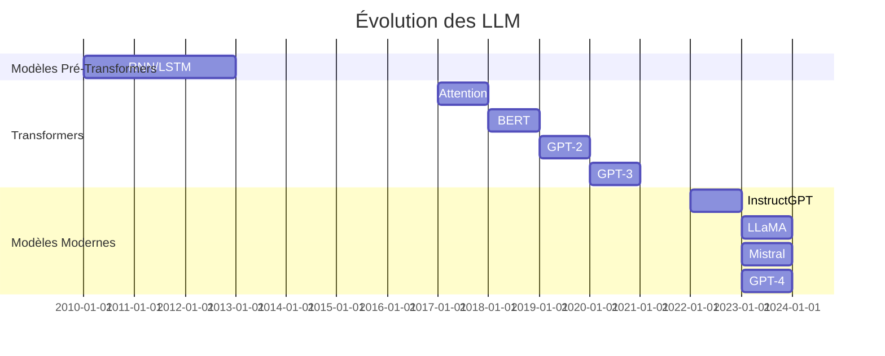
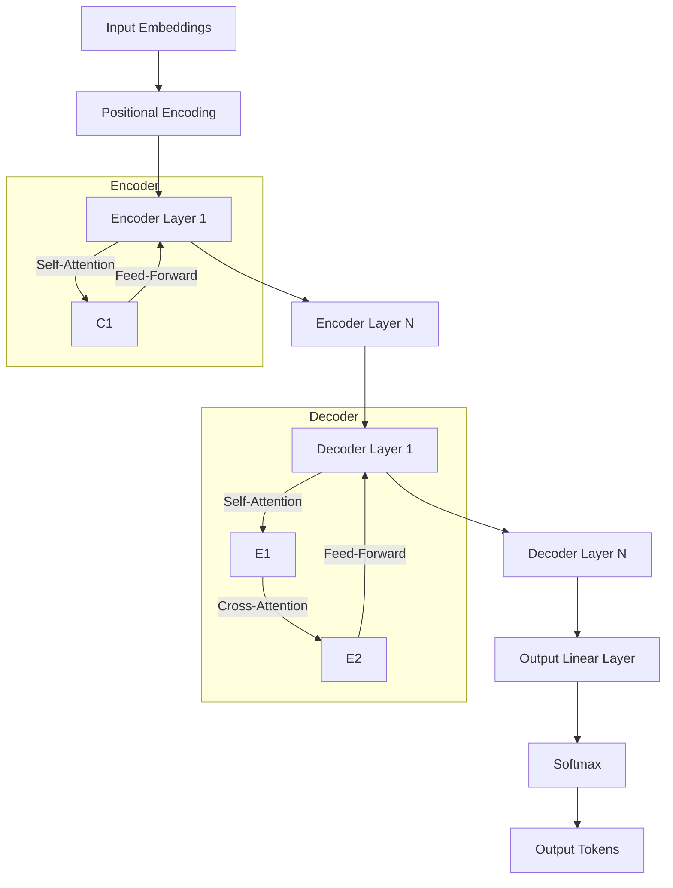
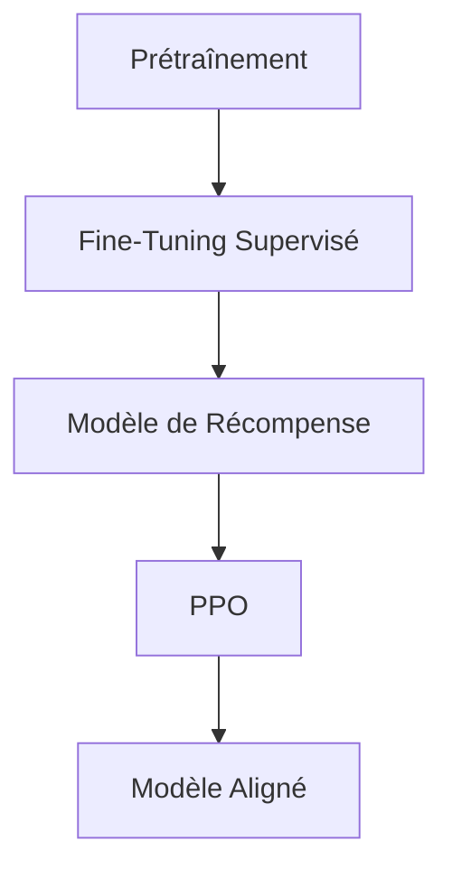
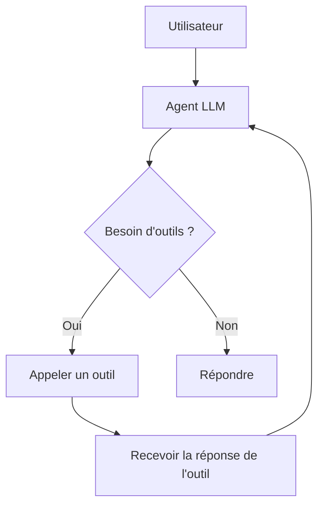
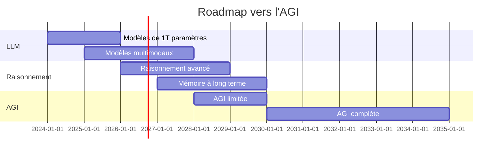
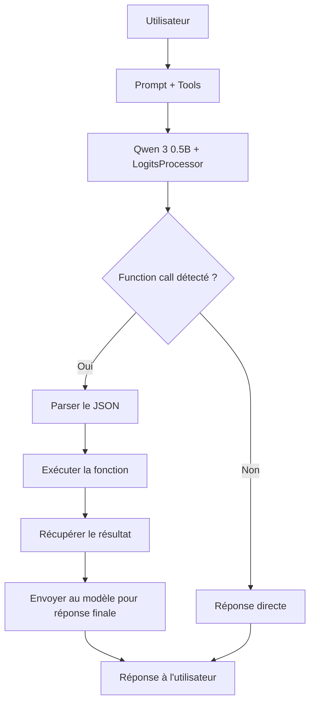

# 🧠 **Cours Complet sur le Fonctionnement des LLM**

*De la Tokenisation à l'Inférence, en Passant par l'Architecture Transformer*

---

## 📚 **Table des Matières**

1. [Introduction aux LLM](#1-introduction-aux-llm)
2. [🔤 La Tokenisation : Le Langage en Nombres](#2-️-la-tokenisation-le-langage-en-nombres)
3. [🏗️ Architectures Fondamentales](#3-️-architectures-fondamentales)
4. [📊 Prétraitement des Données](#4-️-prétraitement-des-données)
5. [🎓 L'Entraînement des LLM](#5-️-lentraînement-des-llm)
6. [⚡ L'Inférence : Génération de Texte](#6-⚡-linférence-génération-de-texte)
7. [🔧 Fine-Tuning et Adaptation](#7-️-fine-tuning-et-adaptation)
8. [⚙️ Optimisations et Accélérations](#8-⚙️-optimisations-et-accélérations)
9. [📈 Évaluation des LLM](#9-️-évaluation-des-llm)
10. [⚠️ Défis et Limites](#10-⚠️-défis-et-limites)
11. [🚀 Applications Pratiques](#11-🚀-applications-pratiques)
12. [🔮 L'Avenir des LLM](#12-🔮-lavenir-des-llm)
13. [📖 Annexes Techniques](#13-📖-annexes-techniques)
14. [🎯 PROJET 42 : Function Calling avec Qwen 3 0.5B — Logits & Constrained Decoding](#14-🎯-projet-42) ⭐

---

---

## **1️⃣ Introduction aux LLM**

### **1.1 Qu'est-ce qu'un LLM ?**

Un **Large Language Model (LLM)** est un modèle d'apprentissage profond capable de comprendre, générer et manipuler du **langage naturel** à grande échelle. Ces modèles sont entraînés sur des **milliards de tokens** de texte pour capturer les motifs linguistiques, la sémantique et même des connaissances factuelles.

#### **Caractéristiques Clés**


| Propriété         | Description                                   | Exemple                   |
| ----------------- | --------------------------------------------- | ------------------------- |
| **Taille**        | Nombre de paramètres (poids)                  | 7B, 13B, 70B, 175B        |
| **Contexte**      | Taille de la fenêtre de contexte              | 2048, 4096, 32768 tokens  |
| **Prétraînement** | Apprentissage non supervisé sur du texte brut | Common Crawl, Wikipedia   |
| **Génération**    | Production de texte probabiliste              | Auto-complétion, chatbots |
| **Multimodal**    | Capacité à traiter texte + images/audio       | GPT-4V, LLaVA             |


#### **Évolution Historique**



#### **Pourquoi les LLM sont-ils révolutionnaires ?**

✅ **Généralisation** : Pas besoin d'entraîner un modèle par tâche (contrairement aux anciens systèmes).  
✅ **Émergence** : Capacités non explicitement entraînées (ex : raisonnement mathématique).  
✅ **Scalabilité** : Plus le modèle est grand, mieux il performe (loi de scaling).  
✅ **Flexibilité** : Adaptables via **fine-tuning** ou **prompt engineering**.

---

### **1.2 Terminologie Essentielle**


| Terme              | Définition                                        | Exemple                                                              |
| ------------------ | ------------------------------------------------- | -------------------------------------------------------------------- |
| **Token**          | Unité de base du texte (mot, sous-mot, caractère) | "chat" → 1 token, "chien" → 1 token                                  |
| **Embedding**      | Représentation vectorielle d'un token             | `[0.2, -0.5, 0.8, ...]`                                              |
| **Attention**      | Mécanisme pour pondérer l'importance des mots     | "Le chat **mange** la souris" → "mange" porte l'attention sur "chat" |
| **Contexte**       | Fenêtre de tokens visibles par le modèle          | "Raconte-moi une histoire sur..." (2048 tokens max)                  |
| **Top-k Sampling** | Méthode de génération aléatoire contrôlée         | k=50 → sélection parmi les 50 meilleurs tokens                       |
| **Temperature**    | Paramètre contrôlant la créativité                | T=0.1 (déterministe) vs T=1.0 (créatif)                              |
| **Hallucination**  | Génération de fausses informations                | "La capitale de la France est Berlin"                                |


---

### **1.3 Comparaison avec d'Anciennes Approches**


| Approche                           | Avantages                                        | Inconvénients                             | Exemple                            |
| ---------------------------------- | ------------------------------------------------ | ----------------------------------------- | ---------------------------------- |
| **Règles (ELIZA, 1966)**           | Simple, déterministe                             | Rigide, pas de compréhension              | Chatbots basiques                  |
| **Modèles Statistiques (N-grams)** | Rapide, interprétable                            | Contexte limité, pas de généralisation    | Autocorrecteur                     |
| **RNN/LSTM**                       | Mémoire séquentielle                             | Difficile à entraîner, vanishing gradient | Traduction automatique (2010-2017) |
| **Transformers (LLM)**             | **Contexte long, parallélisable, généralisable** | Coûteux, gourmand en données              | GPT-4, Mistral, LLaMA              |


---

---

## **2️⃣ 🔤 La Tokenisation : Le Langage en Nombres**

### **2.1 Pourquoi la Tokenisation ?**

Les LLM ne traitent **pas directement du texte** : ils travaillent avec des **nombres** (tensors). La tokenisation est le processus de conversion du texte en une séquence de **nombres entiers** (IDs de tokens).

#### **Exemple Simple**

```
Texte : "J'aime les LLM !"
→ Tokens : ["J'", "aime", " les", " L", "LM", " !"]
→ IDs : [123, 456, 789, 101, 112, 131]
```

---

### **2.2 Types de Tokenisation**

#### **🔹 1. Tokenisation par Caractère**

- Chaque **caractère** = 1 token.
- **Avantage** : Vocabulaire minimal (256 tokens pour ASCII).
- **Inconvénient** : Séquences très longues (inefficace).

**Exemple** :

```
"chat" → ["c", "h", "a", "t"] → [99, 104, 97, 116]
```

#### **🔹 2. Tokenisation par Mot**

- Chaque **mot** = 1 token.
- **Avantage** : Séquences courtes.
- **Inconvénient** : Vocabulaire énorme (millions de mots), mots inconnus (OOV).

**Exemple** :

```
"J'aime les LLM" → ["J'aime", "les", "LLM"] → [5000, 12, 8000]
```

**Problème** : Que faire de "chatbot" ? → Non dans le vocabulaire → **OOV (Out-of-Vocabulary)**.

#### **🔹 3. Tokenisation par Sous-Mots (Subword Tokenization)**

- **Solution** : Découper les mots en **sous-unités fréquentes**.
- **Méthodes** :
  - **BPE (Byte Pair Encoding)** : Fusionne les paires de caractères les plus fréquentes.
  - **WordPiece** : Similaire à BPE, mais utilise une approche basée sur la probabilité.
  - **Unigram** : Sélectionne les sous-mots les plus utiles.

**Exemple avec BPE** :

```
Vocabulaire initial : ["c", "h", "a", "t", "b", "o"]
Étape 1 : Fusionner "ch" (fréquent) → ["ch", "a", "t", "b", "o"]
Étape 2 : Fusionner "at" → ["ch", "at", "b", "o"]
Étape 3 : Fusionner "bo" → ["ch", "at", "bo"]
Résultat : "chatbot" → ["ch", "at", "bo", "t"]
```

#### **🔹 4. Tokenisation par SentencePiece**

- Utilisé par **Google (T5, BERT)** et **Mistral**.
- **Avantage** : Gère les espaces comme des tokens normaux (pas besoin de les séparer).
- **Exemple** :
  ```
  "J'aime les LLM" → ["▁J'aime", "▁les", "▁LLM"]
  (▁ = espace)
  ```

---

### **2.3 BPE (Byte Pair Encoding) en Détail**

#### **Algorithme BPE**

1. **Initialisation** : Commencer avec un vocabulaire de tous les **caractères uniques** (256 pour UTF-8).
2. **Compter les paires** : Trouver la paire de caractères la plus fréquente dans le corpus.
3. **Fusionner** : Remplacer toutes les occurrences de cette paire par un **nouveau token**.
4. **Répéter** : Jusqu'à atteindre la taille de vocabulaire souhaitée (ex : 50 000 tokens).

**Exemple Complet** :

```
Corpus : ["low", "lower", "new", "newer"]
Étape 1 : Vocabulaire = [l, o, w, e, r, n, (espace)]
Étape 2 : Paires fréquentes : "lo", "ow", "ne", "ew", "er"
→ Fusionner "er" (la plus fréquente) → Nouveau token : "er"
Étape 3 : Vocabulaire = [l, o, w, e, r, n, (espace), "er"]
→ "lower" = [l, o, w, "er"]
→ "newer" = [n, e, w, "er"]
Étape 4 : Fusionner "lo" → Nouveau token : "lo"
→ "low" = ["lo", w]
Étape 5 : Fusionner "ne" → Nouveau token : "ne"
→ "new" = ["ne", w]
```

#### **Implémentation en Python (Simplifiée)**

```python
from collections import defaultdict

def get_stats(vocab, corpus):
    # Compte les paires de tokens dans le corpus
    pairs = defaultdict(int)
    for text in corpus:
        tokens = list(text)
        for i in range(len(tokens) - 1):
            pairs[(tokens[i], tokens[i+1])] += 1
    return pairs

def merge_vocab(pair, vocab, corpus):
    # Fusionne une paire dans le vocabulaire et le corpus
    a, b = pair
    new_token = a + b
    vocab.add(new_token)
    # Remplacer dans le corpus
    new_corpus = []
    for text in corpus:
        new_text = text.replace(a + b, new_token)
        new_corpus.append(new_text)
    return vocab, new_corpus

# Exemple d'utilisation
vocab = set(['l', 'o', 'w', 'e', 'r', 'n'])
corpus = ['low', 'lower', 'new', 'newer']

for _ in range(3):  # 3 itérations
    stats = get_stats(vocab, corpus)
    best_pair = max(stats, key=stats.get)
    vocab, corpus = merge_vocab(best_pair, vocab, corpus)
    print(f"Fusion de {best_pair} → Vocabulaire : {vocab}")
```

---

### **2.4 Comment Fonctionne la Tokenisation dans les LLM Modernes**

#### **🔹 Exemple avec le Tokenizer de Mistral**

```python
from transformers import AutoTokenizer

# Charger le tokenizer de Mistral-7B
tokenizer = AutoTokenizer.from_pretrained("mistralai/Mistral-7B-v0.1")

# Tokenisation
text = "J'aime les LLM !"
tokens = tokenizer.tokenize(text)
ids = tokenizer.encode(text, add_special_tokens=False)

print("Texte :", text)
print("Tokens :", tokens)
print("IDs :", ids)
```

**Sortie typique** :

```
Texte : J'aime les LLM !
Tokens : ['▁J', 'aime', '▁les', '▁LL', 'M', '▁!']
IDs : [12, 4567, 890, 1234, 5678, 901]
```

#### **🔹 Spécial Tokens**


| Token    | Rôle                        | Exemple                                               |
| -------- | --------------------------- | ----------------------------------------------------- |
| `[PAD]`  | Remplissage (padding)       | Pour uniformiser la longueur des séquences            |
| `[CLS]`  | Classification (BERT)       | Début de séquence pour les tâches de classification   |
| `[SEP]`  | Séparateur (BERT)           | Séparation entre deux phrases                         |
| `[MASK]` | Masquage (BERT)             | Pour le **Masked Language Modeling**                  |
| `[UNK]`  | Inconnu (OOV)               | Token non présent dans le vocabulaire                 |
| `<s>`    | Début de séquence (Mistral) | `tokenizer.add_special_tokens({"bos_token": "<s>"})`  |
| `</s>`   | Fin de séquence (Mistral)   | `tokenizer.add_special_tokens({"eos_token": "</s>"})` |


---

### **2.5 Impact de la Tokenisation sur les Performances**

#### **🔹 Longueur des Séquences**

- Plus le vocabulaire est grand, **moins il y a de tokens** pour un texte donné.
- **Exemple** :
  - Vocabulaire de 10k tokens → "chatbot" = 2 tokens (`["chat", "bot"]`).
  - Vocabulaire de 50k tokens → "chatbot" = 1 token (`["chatbot"]`).

#### **🔹 Taille du Vocabulaire**


| Vocabulaire                   | Taille Typique | Utilisation            |
| ----------------------------- | -------------- | ---------------------- |
| **Caractères**                | 256            | Très rare (inefficace) |
| **Sous-mots (BPE)**           | 10k - 50k      | GPT-2, Mistral         |
| **Sous-mots (WordPiece)**     | 30k - 100k     | BERT, T5               |
| **Sous-mots (SentencePiece)** | 32k - 256k     | LLama, PaLM            |


#### **🔹 Optimisations**

- **Byte-Level BPE** (GPT-2, Mistral) : Traite le texte en **bytes** (UTF-8), pas en caractères Unicode.
  - **Avantage** : Gère tous les caractères (émojis, chinois, etc.) sans OOV.
  - **Exemple** : "😊" → Découpé en bytes → puis fusionné en un token.
- **Unigram avec Shrinkage** (T5) : Réduit la taille du vocabulaire en supprimant les tokens peu utiles.

---

### **2.6 Exercice Pratique : Tokenisation Manuelle**

**Texte** : "Le chat mange la souris."  
**Vocabulaire BPE** : \["Le", " chat", " mang", "e", " la", " souris", ".", "e la"\]

**Question** : Comment ce texte serait-il tokenisé ?  
**Réponse** :

```
"Le chat mange la souris." → ["Le", " chat", " mang", "e la", " souris", "."]
```

---

---

## **3️⃣ 🏗️ Architectures Fondamentales**

### **3.1 Les Réseaux de Neurones pour le NLP**

#### **🔹 1. RNN (Recurrent Neural Networks)**

- **Idée** : Utiliser une **mémoire cachée** pour traiter les séquences.
- **Problème** : **Vanishing Gradient** (difficile d'apprendre les dépendances longues).

**Schéma** :

```
X₁ → [RNN] → h₁ → Y₁
         ↓
X₂ → [RNN] → h₂ → Y₂
         ↓
X₃ → [RNN] → h₃ → Y₃
```

#### **🔹 2. LSTM (Long Short-Term Memory)**

- **Solution** : Ajouter des **portes** pour contrôler le flux d'information.
- **Avantage** : Meilleure gestion des dépendances longues.
- **Inconvénient** : **Lent** (traitement séquentiel).

**Schéma d'une cellule LSTM** :

```
          ┌───────────────────┐
          │   Cell State (C)   │
          └───────────┬───────┘
                      │
┌─────────┐     ┌─────▼─────┐     ┌─────────┐
│  Xₜ     │────▶│   Porte    │────▶│  hₜ     │
└─────────┘     │ d'oubli   │     └─────────┘
                └─────┬─────┘
                      │
                ┌─────▼─────┐
                │ Porte      │
                │ d'entrée   │
                └─────┬─────┘
                      │
                ┌─────▼─────┐
                │ Porte      │
                │ de sortie  │
                └───────────┘
```

#### **🔹 3. Transformers : La Révolution (2017)**

- **Idée** : **Auto-Attention** pour capturer les dépendances **sans récurrence**.
- **Avantage** : **Parallélisable** (entraînement et inférence rapides).
- **Inconvénient** : Complexité quadratique (`O(n²)` pour une séquence de longueur `n`).

**Schéma d'un Transformer** :



---

### **3.2 L'Attention : Le Cœur des Transformers**

#### **🔹 Self-Attention**

- **But** : Pour chaque token, calculer son **importance relative** par rapport aux autres tokens.
- **Formule** :
  ```
  Attention(Q, K, V) = softmax(QKᵀ / √dₖ) * V
  ```
  - `Q` = Query (ce que je cherche)
  - `K` = Key (ce que les autres tokens offrent)
  - `V` = Value (la valeur associée aux keys)
  - `dₖ` = dimension des keys (pour normaliser)

**Exemple** :

```
Texte : "Le chat mange la souris"
Pour le token "mange" :
- Q = Embedding de "mange"
- K = Embeddings de ["Le", "chat", "mange", "la", "souris"]
- V = Embeddings de ["Le", "chat", "mange", "la", "souris"]

→ Attention("mange") = softmax(QKᵀ) * V
→ "mange" porte plus d'attention sur "chat" (sujet) et "souris" (objet).
```

#### **🔹 Multi-Head Attention**

- **Idée** : Utiliser **plusieurs têtes d'attention** en parallèle pour capturer différents types de relations.
- **Exemple** :
  - Tête 1 : Relations syntaxiques (sujet-verbe-objet).
  - Tête 2 : Relations sémantiques (synonymes).
  - Tête 3 : Dépendances locales (mots voisins).

**Schéma** :

```
Input → [Head 1: Q₁,K₁,V₁] → Attention₁
       → [Head 2: Q₂,K₂,V₂] → Attention₂
       → ...
       → [Head N: Qₙ,Kₙ,Vₙ] → Attentionₙ
       → Concat(Attention₁, ..., Attentionₙ) → Output
```

#### **🔹 Positional Encoding**

- **Problème** : Les Transformers n'ont **pas de notion d'ordre** (contrairement aux RNN).
- **Solution** : Ajouter un **encodage de position** aux embeddings.
- **Formule (sinusoïdale)** :
  ```
  PE(pos, 2i) = sin(pos / 10000^(2i/d))
  PE(pos, 2i+1) = cos(pos / 10000^(2i/d))
  ```
  où \`pos\` = position dans la séquence, \`i\` = dimension.

**Exemple** :

```python
import math
import numpy as np

def positional_encoding(max_len, d_model):
    pe = np.zeros((max_len, d_model))
    position = np.arange(0, max_len)[:, np.newaxis]
    div_term = np.exp(np.arange(0, d_model, 2) * -(math.log(10000.0) / d_model))
    pe[:, 0::2] = np.sin(position * div_term)
    pe[:, 1::2] = np.cos(position * div_term)
    return pe

pe = positional_encoding(10, 512)  # 10 tokens, 512 dimensions
```

---

### **3.3 Architectures de LLM**

#### **🔹 1. Encoder-Only (BERT, RoBERTa)**

- **Utilisation** : Compréhension de texte (classification, Q&amp;A).
- **Fonctionnement** :
  - **Masked Language Modeling (MLM)** : Masquer des tokens et les prédire.
  - **Next Sentence Prediction (NSP)** : Prédire si deux phrases sont liées.
- **Exemple** :
  ```
  Input : "Le chat [MASK] la souris."
  Output : "mange"
  ```

**Schéma** :

```
[Input Tokens] → [Encoder] → [MLM Head] → [Predictions]
```

#### **🔹 2. Decoder-Only (GPT, LLaMA, Mistral)**

- **Utilisation** : Génération de texte (chatbots, écriture).
- **Fonctionnement** :
  - **Causal Language Modeling** : Prédire le **prochain token** à partir des précédents.
  - **Masquage** : Les tokens futurs sont **masqués** (pour éviter le triche).
- **Exemple** :
  ```
  Input : "Le chat"
  Output : "mange la souris."
  ```

**Schéma** :

```
[Input Tokens] → [Decoder (Causal Mask)] → [LM Head] → [Next Token]
```

#### **🔹 3. Encoder-Decoder (T5, BART)**

- **Utilisation** : Traduction, résumé, tâches séquentielles.
- **Fonctionnement** :
  - **Encoder** : Comprend le texte source.
  - **Decoder** : Génère le texte cible.
- **Exemple** :
  ```
  Input (Encoder) : "Hello, how are you?"
  Output (Decoder) : "Bonjour, comment allez-vous ?"
  ```

**Schéma** :

```
[Source Tokens] → [Encoder] → [Cross-Attention] → [Decoder] → [Target Tokens]
```

---

### **3.4 Comparaison des Architectures**


| Architecture        | Type                | Cas d'Usage                  | Exemples               | Entraînement    |
| ------------------- | ------------------- | ---------------------------- | ---------------------- | --------------- |
| **Encoder-Only**    | Compréhension       | Classification, Q&amp;A, NER | BERT, RoBERTa, DeBERTa | MLM + NSP       |
| **Decoder-Only**    | Génération          | Chatbots, écriture, code     | GPT-3, LLaMA, Mistral  | CLM (Causal LM) |
| **Encoder-Decoder** | Séquence-à-séquence | Traduction, résumé           | T5, BART, MarianMT     | Seq2Seq LM      |


---

### **3.5 Exemple : Architecture de Mistral-7B**

```python
from transformers import AutoModelForCausalLM

model = AutoModelForCausalLM.from_pretrained("mistralai/Mistral-7B-v0.1")
print(model)
```

**Sortie** :

```
MistralForCausalLM(
  (model): MistralModel(
    (embed_tokens): Embedding(32000, 4096)  # 32k tokens, 4096 dimensions
    (layers): ModuleList(
      (0-31): 32 x MistralDecoderLayer(  # 32 couches
        (self_attn): MistralAttention(
          (q_proj): Linear(4096, 4096)
          (k_proj): Linear(4096, 4096)
          (v_proj): Linear(4096, 4096)
          (o_proj): Linear(4096, 4096)
        )
        (mlp): MistralMLP(
          (gate_proj): Linear(4096, 14336)  # 14336 = 4 * 4096 / 3 * 2 (approx)
          (up_proj): Linear(4096, 14336)
          (down_proj): Linear(14336, 4096)
        )
      )
    )
    (norm): LayerNorm((4096,))
  )
  (lm_head): Linear(4096, 32000)  # 32k tokens en sortie
)
```

**Détails** :

- **32 couches** (layers) de Transformers.
- **4096 dimensions** pour les embeddings et l'attention.
- **32 000 tokens** dans le vocabulaire.
- **14 336 dimensions** pour le MLP (Feed-Forward).
- **Grouped-Query Attention (GQA)** : Optimisation pour réduire la mémoire.

---

---

## **4️⃣ 📊 Prétraitement des Données**

### **4.1 Collecte du Corpus**

#### **🔹 Sources de Données**


| Source           | Taille   | Contenu                  | Exemple                                                       |
| ---------------- | -------- | ------------------------ | ------------------------------------------------------------- |
| **Common Crawl** | \~200 To | Pages web                | [commoncrawl.org](https://commoncrawl.org)                    |
| **Wikipedia**    | \~20 Go  | Articles encyclopédiques | [wikipedia.org](https://wikipedia.org)                        |
| **BooksCorpus**  | \~11 Go  | Livres                   | [Noraset/books](https://github.com/Noraset/books)             |
| **GitHub**       | \~100 Go | Code source              | [github.com](https://github.com)                              |
| **The Pile**     | \~800 Go | Mix de sources           | [EleutherAI/the-pile](https://github.com/EleutherAI/the-pile) |
| **Dolma**        | \~3 To   | Corpus massif            | [allenai/dolma](https://github.com/allenai/dolma)             |


#### **🔹 Filtrage des Données**

- **Critères de qualité** :
  - **Longueur** : Éviter les textes trop courts (&lt; 50 tokens) ou trop longs (&gt; 10k tokens).
  - **Langue** : Filtrer par langue (ex : `langdetect`).
  - **Duplicatas** : Supprimer les doublons (`minhash` + `LSH`).
  - **Contenu** : Éviter le spam, le code malveillant, les données personnelles.

**Exemple en Python** :

```python
from langdetect import detect

def filter_text(text, min_length=50, max_length=10000, target_lang="fr"):
    if len(text.split()) < min_length or len(text.split()) > max_length:
        return False
    try:
        if detect(text) != target_lang:
            return False
    except:
        return False
    return True
```

---

### **4.2 Nettoyage du Texte**

#### **🔹 Normalisation**

- **Minimisation** : Convertir en minuscules (optionnel).
- **Suppression des espaces** : Normaliser les espaces multiples.
- **Correction des erreurs** : Utiliser des outils comme `symspellpy` ou `textblob`.

**Exemple** :

```python
import re

def clean_text(text):
    text = text.lower()  # Minuscules
    text = re.sub(r'\s+', ' ', text)  # Espaces multiples
    text = re.sub(r'[^\w\s]', '', text)  # Supprimer la ponctuation (optionnel)
    return text.strip()
```

#### **🔹 Tokenisation et Dédoublonnage**

- **Tokenisation** : Appliquer le tokenizer pour obtenir des IDs.
- **Dédoublonnage** : Utiliser des techniques comme `Bloom Filter` ou `MinHash`.

**Exemple avec MinHash** :

```python
from datasketch import MinHash

# Créer des MinHash pour chaque document
mh1 = MinHash(num_perm=128)
mh2 = MinHash(num_perm=128)

for shingle in get_shingles(doc1):  # Shingles = n-grams de tokens
    mh1.update(shingle.encode('utf8'))

for shingle in get_shingles(doc2):
    mh2.update(shingle.encode('utf8'))

# Calculer la similarité de Jaccard
similarity = mh1.jaccard(mh2)
if similarity > 0.9:  # Seuil de duplicata
    print("Duplicata détecté !")
```

---

### **4.3 Formatage des Données**

#### **🔹 Pour les Modèles Encoder-Only (BERT)**

- **Masked Language Modeling (MLM)** :
  - Masquer **15% des tokens** aléatoirement.
  - **80%** : Remplacer par `[MASK]`.
  - **10%** : Remplacer par un token aléatoire.
  - **10%** : Laisser inchangé.

**Exemple** :

```
Original : "Le chat mange la souris"
Masqué   : "Le [MASK] mange la [MASK]"
```

#### **🔹 Pour les Modèles Decoder-Only (GPT)**

- **Causal Language Modeling (CLM)** :
  - Prédire le **prochain token** à chaque position.
  - **Masquage** : Les tokens futurs sont **masqués** (attention causale).

**Exemple** :

```
Input : "Le chat mange"
Target : " la souris"
```

#### **🔹 Pour les Modèles Encoder-Decoder (T5)**

- **Seq2Seq** :
  - **Input** : Texte source.
  - **Output** : Texte cible.

**Exemple** :

```
Input : "translate English to French: Hello, how are you?"
Output : "Bonjour, comment allez-vous ?"
```

---

### **4.4 Batchification et Padding**

#### **🔹 Batchification**

- **But** : Entraîner sur **plusieurs exemples en parallèle** (GPU/TPU).
- **Problème** : Les séquences ont des **longueurs variables**.
- **Solution** : **Padding** (remplir avec `[PAD]`).

**Exemple** :

```
Séquences :
- [1, 2, 3] (longueur 3)
- [4, 5]     (longueur 2)
- [6, 7, 8, 9] (longueur 4)

Après padding (max_len=4) :
- [1, 2, 3, 0] (0 = [PAD])
- [4, 5, 0, 0]
- [6, 7, 8, 9]
```

#### **🔹 Attention Mask**

- **But** : Ignorer les tokens `[PAD]` dans le calcul de l'attention.
- **Masque** : `1` pour les vrais tokens, `0` pour `[PAD]`.

**Exemple** :

```
Séquence : [1, 2, 3, 0]
Attention Mask : [1, 1, 1, 0]
```

---

---

## **5️⃣ 🎓 L'Entraînement des LLM**

### **5.1 Objectifs d'Entraînement**

#### **🔹 1. Causal Language Modeling (CLM)**

- **Utilisé par** : GPT, LLaMA, Mistral.
- **Objectif** : Maximiser la probabilité du **prochain token**.
- **Fonction de perte** : **Cross-Entropy**.

**Formule** :

```
L = -Σ log(P(token_{i+1} | token_1, ..., token_i))
```

**Exemple** :

```
Texte : "Le chat mange"
P("mange" | "Le chat") = softmax(W * embed("Le chat"))
```

#### **🔹 2. Masked Language Modeling (MLM)**

- **Utilisé par** : BERT, RoBERTa.
- **Objectif** : Prédire les **tokens masqués**.
- **Fonction de perte** : Cross-Entropy sur les tokens masqués.

**Exemple** :

```
Texte : "Le [MASK] mange la souris"
P("chat" | "Le [MASK] mange la souris")
```

#### **🔹 3. Next Sentence Prediction (NSP)**

- **Utilisé par** : BERT.
- **Objectif** : Prédire si **deux phrases sont consécutives**.
- **Fonction de perte** : Binary Cross-Entropy.

**Exemple** :

```
Phrase A : "Le chat est sur le tapis."
Phrase B : "Il dort profondément."
→ Label : 1 (vrai)

Phrase A : "Le chat est sur le tapis."
Phrase B : "La voiture est rouge."
→ Label : 0 (faux)
```

---

### **5.2 Optimisation**

#### **🔹 Optimiseurs**


| Optimiseur    | Avantages           | Inconvénients                   | Utilisation              |
| ------------- | ------------------- | ------------------------------- | ------------------------ |
| **SGD**       | Simple, stable      | Lent, sensible au learning rate | Rare                     |
| **Adam**      | Adaptatif, rapide   | Mémoire élevée                  | Très courant             |
| **AdamW**     | Adam + weight decay | Meilleure généralisation        | Recommandé               |
| **Adafactor** | Mémoire optimisée   | Moins précis                    | Pour très grands modèles |


**Exemple avec AdamW** :

```python
from torch.optim import AdamW

optimizer = AdamW(
    model.parameters(),
    lr=5e-5,  # Learning rate
    weight_decay=0.01,  # Régularisation L2
    betas=(0.9, 0.999),  # Paramètres de momentum
    eps=1e-8  # Éviter la division par zéro
)
```

#### **🔹 Learning Rate Scheduling**

- **Idée** : Ajuster le **learning rate** pendant l'entraînement.
- **Méthodes** :
  - **Linear Warmup** : Augmenter progressivement le LR au début.
  - **Cosine Decay** : Diminuer le LR selon une courbe cosinus.
  - **Step Decay** : Diminuer le LR à intervalles réguliers.

**Exemple avec Linear Warmup + Cosine Decay** :

```python
from transformers import get_linear_schedule_with_warmup, get_cosine_schedule_with_warmup

# Linear Warmup
scheduler = get_linear_schedule_with_warmup(
    optimizer,
    num_warmup_steps=1000,  # 1000 étapes de warmup
    num_training_steps=100000
)

# Cosine Decay
scheduler = get_cosine_schedule_with_warmup(
    optimizer,
    num_warmup_steps=1000,
    num_training_steps=100000
)
```

---

### **5.3 Techniques d'Entraînement Avancées**

#### **🔹 Mixed Precision Training**

- **Idée** : Utiliser des **float16** au lieu de **float32** pour économiser de la mémoire.
- **Avantage** : **2x plus rapide**, moins de mémoire GPU.
- **Inconvénient** : Risque de **underflow/overflow** (géré par `amp` dans PyTorch).

**Exemple avec PyTorch** :

```python
from torch.cuda.amp import GradScaler, autocast

scaler = GradScaler()

for epoch in range(epochs):
    for batch in dataloader:
        with autocast():  # Utilise float16
            outputs = model(batch)
            loss = outputs.loss
        scaler.scale(loss).backward()  # Scale le gradient
        scaler.step(optimizer)
        scaler.update()  # Met à jour le scaler
        optimizer.zero_grad()
```

#### **🔹 Gradient Accumulation**

- **Idée** : Accumuler les gradients sur **plusieurs batches** avant de faire un `step`.
- **Avantage** : Permet d'utiliser des **batch sizes plus grands** que la mémoire GPU.

**Exemple** :

```python
accumulation_steps = 4

for i, batch in enumerate(dataloader):
    outputs = model(batch)
    loss = outputs.loss / accumulation_steps  # Normaliser
    loss.backward()
    
    if (i + 1) % accumulation_steps == 0:
        optimizer.step()
        optimizer.zero_grad()
```

#### **🔹 Gradient Clipping**

- **Idée** : Limiter la **norme du gradient** pour éviter les **explosions**.
- **Avantage** : Stabilité de l'entraînement.

**Exemple** :

```python
torch.nn.utils.clip_grad_norm_(model.parameters(), max_norm=1.0)
```

---

### **5.4 Entraînement Distribué**

#### **🔹 Data Parallelism**

- **Idée** : Diviser le **batch** sur plusieurs GPUs.
- **Avantage** : Augmente la taille effective du batch.
- **Inconvénient** : Nécessite de synchroniser les gradients.

**Schéma** :

```
Batch : [x1, x2, x3, x4]
GPU 1 : [x1, x2] → Gradients → Synchronisation
GPU 2 : [x3, x4] → Gradients → Synchronisation
```

**Exemple avec PyTorch** :

```python
model = nn.DataParallel(model, device_ids=[0, 1, 2, 3])
```

#### **🔹 Model Parallelism (Tensor Parallelism)**

- **Idée** : Diviser le **modèle** sur plusieurs GPUs.
- **Avantage** : Permet d'entraîner des modèles **plus grands** que la mémoire d'un seul GPU.
- **Inconvénient** : Complexe à implémenter.

**Exemple avec Megatron-LM** :

```python
from megatron.core import ModelParallelConfig

config = ModelParallelConfig(
    tensor_model_parallel_size=4,  # 4 GPUs
    pipeline_model_parallel_size=1
)
model = build_model(config)
```

#### **🔹 Pipeline Parallelism**

- **Idée** : Diviser les **couches** du modèle sur plusieurs GPUs.
- **Avantage** : Permet de traiter des **séquences très longues**.
- **Inconvénient** : Latence élevée (séquentiel).

**Schéma** :

```
GPU 1 : Couches 1-8 → GPU 2 : Couches 9-16 → GPU 3 : Couches 17-24
```

#### **🔹 ZeRO (Zero Redundancy Optimizer)**

- **Idée** : **Partager les paramètres, gradients et optimiseurs** entre GPUs.
- **Niveaux** :
  - **ZeRO-1** : Optimiseur partitionné.
  - **ZeRO-2** : Optimiseur + gradients partitionnés.
  - **ZeRO-3** : Optimiseur + gradients + paramètres partitionnés.
- **Avantage** : Permet d'entraîner des modèles **énormes** (ex : 175B paramètres).

**Exemple avec DeepSpeed** :

```python
from deepspeed import initialize

model_engine, optimizer, _, _ = initialize(
    model=model,
    model_parameters=model.parameters(),
    config_params="ds_config.json"  # Fichier de config ZeRO
)
```

---

### **5.5 Coût de l'Entraînement**

#### **🔹 Estimation des Ressources**


| Modèle       | Paramètres | Données     | Coût (USD) | Temps       | Hardware         |
| ------------ | ---------- | ----------- | ---------- | ----------- | ---------------- |
| GPT-3 (175B) | 175B       | 300B tokens | \~4.6M     | \~30 jours  | 1024 GPUs (V100) |
| LLaMA-7B     | 7B         | 1.4T tokens | \~100k     | \~7 jours   | 64 GPUs (A100)   |
| Mistral-7B   | 7B         | 1.5T tokens | \~50k      | \~5 jours   | 32 GPUs (A100)   |
| GPT-4        | \~1.7T     | ?           | \~100M+    | \~100 jours | 10k+ GPUs        |


#### **🔹 Calcul du Coût**

- **Formule** :
  ```
  Coût = (Nombre de tokens) × (Nombre d'époques) × (Coût par token)
  ```
- **Coût par token** :
  - **Forward Pass** : \~1 FLOP/paramètre/token.
  - **Backward Pass** : \~2 FLOP/paramètre/token.
  - **Total** : \~3 FLOP/paramètre/token.

**Exemple pour Mistral-7B** :

```
Paramètres = 7B
Tokens = 1.5T
Époques = 1
FLOPs = 7e9 * 1.5e12 * 3 = 31.5e21 FLOPs
Coût (A100 : 312 TFLOPs/s, 0.5 $/h) :
→ Temps = 31.5e21 / 312e12 = ~100M secondes = ~1157 jours
→ Coût = 1157 × 24 × 0.5 ≈ 14k $ (théorique, optimisé en pratique)
```

---

---

## **6️⃣ ⚡ L'Inférence : Génération de Texte**

### **6.1 Processus d'Inférence**

#### **🔹 Étapes de la Génération**

1. **Tokenisation** : Convertir le **prompt** en tokens.
2. **Embedding** : Convertir les tokens en **vecteurs**.
3. **Passage dans le modèle** : Calculer les **logits** (scores pour chaque token).
4. **Sélection du prochain token** : Appliquer une **stratégie de sampling**.
5. **Répéter** : Ajouter le token généré au contexte et recommencer.

**Schéma** :

```
Prompt : "Le chat"
→ Tokens : ["Le", " chat"]
→ Embeddings : [E1, E2]
→ Modèle : Logits = [0.1, 0.2, ..., 0.8, ...] (32k valeurs)
→ Sampling : Token sélectionné = "mange"
→ Nouveau prompt : "Le chat mange"
→ Répéter...
```

---

### **6.2 Stratégies de Sampling**

#### **🔹 1. Greedy Search**

- **Idée** : Toujours choisir le **token avec la plus haute probabilité**.
- **Avantage** : **Déterministe**, rapide.
- **Inconvénient** : **Peu créatif**, risque de boucles.

**Exemple** :

```
Logits : ["mange" : 0.5, "dort" : 0.4, "court" : 0.1]
→ Sélection : "mange"
```

#### **🔹 2. Random Sampling (Softmax)**

- **Idée** : Tirer un token **aléatoirement** selon la distribution de probabilité.
- **Avantage** : **Créatif**, varié.
- **Inconvénient** : Peut générer du **non-sens** (faible probabilité).

**Exemple** :

```
P("mange") = 0.5, P("dort") = 0.4, P("court") = 0.1
→ Random : "court" (même si peu probable)
```

#### **🔹 3. Top-k Sampling**

- **Idée** : Ne garder que les **k tokens les plus probables**, puis échantillonner parmi eux.
- **Avantage** : **Équilibre** entre créativité et cohérence.
- **Paramètre** : `k` (ex : 50).

**Exemple** :

```
Logits : ["mange" : 0.5, "dort" : 0.4, "court" : 0.1, "saute" : 0.05, ...]
Top-2 : ["mange", "dort"]
→ Random parmi ces 2.
```

#### **🔹 4. Top-p Sampling (Nucleus Sampling)**

- **Idée** : Garder les tokens **jusqu'à ce que leur probabilité cumulée atteigne p**.
- **Avantage** : **Dynamique** (k varie selon la distribution).
- **Paramètre** : `p` (ex : 0.9).

**Exemple** :

```
P("mange") = 0.5, P("dort") = 0.4, P("court") = 0.05, P("saute") = 0.03, P("...") = 0.02
Top-p (p=0.9) : ["mange", "dort", "court"] (0.5 + 0.4 + 0.05 = 0.95 > 0.9)
→ Random parmi ces 3.
```

#### **🔹 5. Beam Search**

- **Idée** : Garder **plusieurs hypothèses** (beams) à chaque étape et choisir la meilleure séquence globale.
- **Avantage** : **Meilleure qualité** (optimisation globale).
- **Inconvénient** : **Lent** (complexité exponentielle).
- **Paramètre** : `num_beams` (ex : 5).

**Exemple** :

```
Étape 1 :
- Beam 1 : "Le chat mange" (score = 0.5)
- Beam 2 : "Le chat dort" (score = 0.4)
- Beam 3 : "Le chat court" (score = 0.1)

Étape 2 :
- Beam 1 : "Le chat mange la" (score = 0.5 * 0.6 = 0.3)
- Beam 2 : "Le chat dort sur" (score = 0.4 * 0.5 = 0.2)
- Beam 3 : "Le chat mange la souris" (score = 0.5 * 0.6 * 0.7 = 0.21)
→ Sélection : "Le chat mange la souris" (meilleur score final)
```

---

### **6.3 Paramètres de Génération**


| Paramètre               | Description                   | Effet                                            | Valeur Typique |
| ----------------------- | ----------------------------- | ------------------------------------------------ | -------------- |
| **temperature**         | Contrôle la **créativité**    | `T→0` : déterministe, `T→∞` : aléatoire          | 0.7 - 1.0      |
| **top\_k**              | Nombre de tokens à considérer | `k=1` : greedy, `k=∞` : softmax                  | 50             |
| **top\_p**              | Probabilité cumulée           | `p=1.0` : softmax, `p=0.1` : très sélectif       | 0.9            |
| **num\_beams**          | Nombre de beams               | `1` : greedy, `5` : meilleure qualité            | 1 - 10         |
| **repetition\_penalty** | Pénalise les répétitions      | `1.0` : neutre, `>1` : décourage les répétitions | 1.1 - 1.3      |
| **max\_new\_tokens**    | Longueur max de la génération | Limite la sortie                                 | 50 - 512       |
| **do\_sample**          | Activer le sampling           | `True` : aléatoire, `False` : greedy             | True/False     |


**Exemple avec HuggingFace** :

```python
from transformers import AutoModelForCausalLM, AutoTokenizer

model = AutoModelForCausalLM.from_pretrained("mistralai/Mistral-7B-v0.1")
tokenizer = AutoTokenizer.from_pretrained("mistralai/Mistral-7B-v0.1")

input_text = "Raconte-moi une histoire sur un chat"
inputs = tokenizer(input_text, return_tensors="pt")

outputs = model.generate(
    **inputs,
    max_new_tokens=100,
    temperature=0.7,
    top_k=50,
    top_p=0.9,
    num_beams=5,
    repetition_penalty=1.2,
    do_sample=True
)

generated_text = tokenizer.decode(outputs[0], skip_special_tokens=True)
print(generated_text)
```

---

### **6.4 Optimisations pour l'Inférence**

#### **🔹 1. KV Cache (Key-Value Cache)**

- **Idée** : Sauvegarder les **clés (K)** et **valeurs (V)** de l'attention pour les réutiliser à la prochaine étape.
- **Avantage** : **Évite de recalculer** l'attention pour les tokens déjà traités.
- **Mémoire** : `O(n * d)` où `n` = longueur du contexte, `d` = dimension.

**Schéma** :

```
Étape 1 : "Le chat" → Calcule K, V → Sauvegarde en cache
Étape 2 : "Le chat mange" → Réutilise K, V pour "Le chat" + calcule pour "mange"
```

#### **🔹 2. Speculative Decoding**

- **Idée** : Utiliser un **petit modèle** pour proposer des tokens, puis les valider avec le **grand modèle**. 
- **Avantage** : **2x plus rapide** avec peu de perte de qualité.
- **Exemple** :
  - **Petit modèle** (ex : 70M paramètres) propose 4 tokens.
  - **Grand modèle** (ex : 7B paramètres) valide les 4 tokens en une seule passe.

**Schéma** :

```
Draft Model (70M) : "Le chat mange la"
Target Model (7B) : Valide "Le chat mange la" en une fois
```

#### **🔹 3. Quantisation**

- **Idée** : Réduire la **précision des poids** (float32 → int8/float16).
- **Méthodes** :
  - **FP16** : 16 bits (2x moins de mémoire).
  - **INT8** : 8 bits (4x moins de mémoire, perte de qualité).
  - **BitsandBytes** : Quantisation 4 bits (16x moins de mémoire).
- **Avantage** : **Moins de mémoire**, inférence plus rapide.

**Exemple avec BitsandBytes** :

```python
from transformers import AutoModelForCausalLM, BitsAndBytesConfig

quant_config = BitsAndBytesConfig(
    load_in_4bit=True,
    bnb_4bit_compute_dtype=torch.float16
)

model = AutoModelForCausalLM.from_pretrained(
    "mistralai/Mistral-7B-v0.1",
    quantization_config=quant_config,
    device_map="auto"
)
```

#### **🔹 4. Offloading**

- **Idée** : Déplacer une partie du modèle sur le **CPU** ou le **disque** pour libérer de la mémoire GPU.
- **Avantage** : Permet de faire tourner des **modèles plus grands** que la mémoire GPU.
- **Inconvénient** : **Plus lent** (transfert CPU↔GPU).

**Exemple avec HuggingFace Accelerate** :

```python
from accelerate import init_empty_weights, load_checkpoint_and_dispatch

model = AutoModelForCausalLM.from_pretrained(
    "mistralai/Mistral-7B-v0.1",
    device_map="auto",
    offload_folder="offload",
    offload_state_dict=True
)
```

---

### **6.5 Benchmark des Performances**


| Modèle       | Taille | Tokens/s (A100) | Latence (ms/token) | Mémoire (GB) |
| ------------ | ------ | --------------- | ------------------ | ------------ |
| GPT-2        | 1.5B   | \~50            | \~20               | 6            |
| LLaMA-7B     | 7B     | \~20            | \~50               | 14           |
| Mistral-7B   | 7B     | \~25            | \~40               | 14           |
| LLaMA-13B    | 13B    | \~10            | \~100              | 26           |
| GPT-3 (175B) | 175B   | \~1             | \~1000             | 350          |


---

---

## **7️⃣ 🔧 Fine-Tuning et Adaptation**

### **7.1 Pourquoi le Fine-Tuning ?**

Les LLM **prétraînés** sont génériques. Le **fine-tuning** permet de les **spécialiser** pour une tâche ou un domaine.

#### **🔹 Cas d'Usage**


| Tâche              | Exemple              | Méthode                     |
| ------------------ | -------------------- | --------------------------- |
| **Classification** | Sentiment analysis   | Fine-tuning complet         |
| **Génération**     | Résumé de texte      | Fine-tuning complet         |
| **Q&amp;A**        | Chatbot spécialisé   | Fine-tuning + RLHF          |
| **Traduction**     | Français → Anglais   | Fine-tuning Encoder-Decoder |
| **Code**           | Génération de Python | Fine-tuning sur du code     |


---

### **7.2 Méthodes de Fine-Tuning**

#### **🔹 1. Fine-Tuning Complet (Full Fine-Tuning)**

- **Idée** : **Réentraîner tous les paramètres** du modèle.
- **Avantage** : **Meilleures performances** pour la tâche cible.
- **Inconvénient** : **Coûteux** (mémoire, temps).

**Exemple** :

```python
from transformers import Trainer, TrainingArguments

training_args = TrainingArguments(
    output_dir="./results",
    per_device_train_batch_size=8,
    num_train_epochs=3,
    learning_rate=5e-5,
    save_steps=10_000,
    logging_dir="./logs",
)

trainer = Trainer(
    model=model,
    args=training_args,
    train_dataset=train_dataset,
    eval_dataset=eval_dataset,
)

trainer.train()
```

#### **🔹 2. PEFT (Parameter-Efficient Fine-Tuning)**

- **Idée** : **Ne mettre à jour qu'une partie des paramètres** pour réduire les coûts.
- **Méthodes** :
  - **LoRA (Low-Rank Adaptation)** : Ajouter des matrices de faible rang.
  - **Adapter** : Ajouter des couches intermédiaires.
  - **Prefix-Tuning** : Ajouter des tokens virtuels au début.

**Exemple avec LoRA** :

```python
from peft import LoraConfig, get_peft_model

lora_config = LoraConfig(
    r=8,  # Rang
    lora_alpha=16,
    target_modules=["q_proj", "v_proj"],  # Couches à adapter
    lora_dropout=0.1,
    task_type="CAUSAL_LM",
)

model = get_peft_model(model, lora_config)
```

**Comparaison des Méthodes PEFT** :


| Méthode              | Paramètres Ajoutés | Mémoire | Temps | Performances |
| -------------------- | ------------------ | ------- | ----- | ------------ |
| **Full Fine-Tuning** | 100%               | ❌❌❌     | ❌❌❌   | ⭐⭐⭐⭐⭐        |
| **LoRA**             | \~1%               | ⭐⭐⭐     | ⭐⭐⭐   | ⭐⭐⭐⭐         |
| **Adapter**          | \~5%               | ⭐⭐      | ⭐⭐    | ⭐⭐⭐          |
| **Prefix-Tuning**    | \~0.1%             | ⭐⭐⭐     | ⭐⭐    | ⭐⭐           |


#### **🔹 3. Prompt Tuning**

- **Idée** : **Optimiser le prompt** (tokens virtuels) au lieu du modèle.
- **Avantage** : **Aucun paramètre du modèle mis à jour**.
- **Inconvénient** : **Moins performant** que le fine-tuning.

**Exemple** :

```python
from peft import PromptTuningConfig, get_peft_model

prompt_config = PromptTuningConfig(
    task_type="CAUSAL_LM",
    num_virtual_tokens=10,  # Nombre de tokens virtuels
)

model = get_peft_model(model, prompt_config)
```

#### **🔹 4. RLHF (Reinforcement Learning from Human Feedback)**

- **Idée** : **Affiner le modèle avec des feedbacks humains** pour aligner ses réponses.
- **Étapes** :
  1. **Prétraînement** : Modèle de base (ex : GPT-3).
  2. **Fine-Tuning Supervisé** : Entraîner sur des paires (prompt, réponse humaine).
  3. **Modèle de Récompense** : Entraîner un modèle pour évaluer les réponses.
  4. **PPO (Proximal Policy Optimization)** : Optimiser le modèle avec RL.

**Schéma** :



**Exemple (InstructGPT)** :

```
1. Prétraînement : GPT-3 sur du texte brut.
2. Fine-Tuning Supervisé : Entraînement sur des paires (Q, R) humaines.
3. Modèle de Récompense : Classifieur pour noter les réponses.
4. PPO : Optimisation avec RL pour maximiser la récompense.
```

---

### **7.3 Outils pour le Fine-Tuning**


| Outil                                        | Description                               | Avantages                                   | Lien                                                      |
| -------------------------------------------- | ----------------------------------------- | ------------------------------------------- | --------------------------------------------------------- |
| **HuggingFace Transformers**                 | Bibliothèque standard pour le fine-tuning | Simple, compatible avec de nombreux modèles | [🔗](https://huggingface.co/docs/transformers/training)   |
| **PEFT**                                     | Parameter-Efficient Fine-Tuning           | LoRA, Adapter, etc.                         | [🔗](https://github.com/huggingface/peft)                 |
| **TRL (Transformer Reinforcement Learning)** | RLHF pour les LLM                         | PPO, DPO                                    | [🔗](https://github.com/huggingface/trl)                  |
| **Axolotl**                                  | Fine-tuning simplifié                     | Interface CLI, support multi-GPU            | [🔗](https://github.com/OpenAccess-AI-Collective/axolotl) |
| **LoRAX**                                    | Fine-tuning LoRA optimisé                 | Rapide, support multi-GPU                   | [🔗](https://github.com/pytorch-labs/lorax)               |


---

### **7.4 Exemple Complet : Fine-Tuning avec LoRA**

**Étape 1 : Préparer les données**

```python
from datasets import load_dataset

dataset = load_dataset("imdb")
dataset = dataset.map(lambda x: tokenizer(x["text"], truncation=True, padding="max_length", max_length=512))
```

**Étape 2 : Configurer LoRA**

```python
from peft import LoraConfig

lora_config = LoraConfig(
    r=8,
    lora_alpha=16,
    target_modules=["q_proj", "v_proj"],
    lora_dropout=0.1,
    task_type="CAUSAL_LM",
    inference_mode=False,
)
```

**Étape 3 : Appliquer LoRA au modèle**

```python
from peft import get_peft_model

model = get_peft_model(model, lora_config)
model.print_trainable_parameters()  # ~1% des paramètres
```

**Étape 4 : Entraîner**

```python
from transformers import Trainer, TrainingArguments

training_args = TrainingArguments(
    output_dir="./results",
    per_device_train_batch_size=8,
    num_train_epochs=3,
    learning_rate=5e-5,
    save_steps=10_000,
    logging_dir="./logs",
    report_to="tensorboard",
)

trainer = Trainer(
    model=model,
    args=training_args,
    train_dataset=dataset["train"],
    eval_dataset=dataset["test"],
)

trainer.train()
```

**Étape 5 : Sauvegarder et tester**

```python
model.save_pretrained("./lora_model")

# Tester
inputs = tokenizer("C'était un film génial !", return_tensors="pt")
outputs = model.generate(**inputs, max_new_tokens=50)
print(tokenizer.decode(outputs[0], skip_special_tokens=True))
```

---

---

## **8️⃣ ⚙️ Optimisations et Accélérations**

### **8.1 Optimisations Matricielles**

#### **🔹 Flash Attention**

- **Idée** : **Optimiser le calcul de l'attention** en réduisant les accès mémoire.
- **Avantage** : **2x plus rapide** pour l'attention.
- **Implémentation** : Intégrée dans PyTorch 2.0+.

**Exemple** :

```python
model = model.to(torch.float16)  # FP16 requis
outputs = model(inputs, use_cache=True)  # Flash Attention activé automatiquement
```

#### **🔹 Fused Kernels**

- **Idée** : **Fusionner des opérations** pour réduire les accès mémoire.
- **Exemples** :
  - `Fused LayerNorm` : Combine LayerNorm + résidu.
  - `Fused Softmax` : Optimise le calcul du softmax.
- **Bibliothèques** : `cute` (NVIDIA), `triton` (OpenAI).

**Exemple avec Triton** :

```python
# Triton permet d'écrire des kernels optimisés en Python
@triton.jit
def fused_softmax(
    x_ptr,  # Pointeur vers l'entrée
    y_ptr,  # Pointeur vers la sortie
    n,      # Taille
):
    # Implémentation optimisée du softmax
    pass
```

---

### **8.2 Optimisations pour l'Inférence**

#### **🔹 vLLM**

- **Idée** : **Optimiser l'inférence** avec :
  - **Paged Attention** : Gestion mémoire efficace pour les longs contextes.
  - **Continuous Batching** : Traiter plusieurs requêtes en parallèle.
- **Avantage** : **Jusqu'à 24x plus rapide** que HuggingFace.

**Exemple** :

```python
from vllm import LLM, SamplingParams

llm = LLM(model="mistralai/Mistral-7B-v0.1", tensor_parallel_size=4)
sampling_params = SamplingParams(temperature=0.7, top_p=0.9)

outputs = llm.generate(
    ["Raconte-moi une histoire"],
    sampling_params,
)

for output in outputs:
    print(output.outputs[0].text)
```

#### **🔹 TensorRT-LLM**

- **Idée** : **Compiler le modèle** pour une inférence optimisée sur GPU NVIDIA.
- **Avantage** : **Jusqu'à 8x plus rapide** que PyTorch natif.

**Exemple** :

```python
from tensorrt_llm import LLM

model = LLM(
    model_path="./mistral-7b",
    engine_dir="./trt_engines",
    max_batch_size=8,
    max_seq_len=512,
)

outputs = model.generate("Le chat mange")
```

---

### **8.3 Optimisations Matérielles**

#### **🔹 GPU vs TPU vs CPU**


| Hardware         | Avantages                           | Inconvénients                    | Utilisation                 |
| ---------------- | ----------------------------------- | -------------------------------- | --------------------------- |
| **GPU (NVIDIA)** | Rapide, optimisé pour DL            | Coûteux, consommation électrique | Entraînement, inférence     |
| **TPU (Google)** | Très rapide pour les grands modèles | Propriétaire, moins flexible     | Entraînement (Google Cloud) |
| **CPU**          | Pas cher, universel                 | Lent pour le DL                  | Inférence légère            |


#### **🔹 NVIDIA A100 vs H100**


| Caractéristique  | A100            | H100            | Amélioration                 |
| ---------------- | --------------- | --------------- | ---------------------------- |
| **Tensor Cores** | 3ème génération | 4ème génération | +2x FLOPs                    |
| **Mémoire**      | 40/80 GB HBM2e  | 80 GB HBM3      | +2x bande passante           |
| **FP8**          | ❌               | ✅               | +2x vitesse pour l'inférence |
| **NVLink**       | 3ème génération | 4ème génération | +2x bande passante           |


#### **🔹 Quantisation Matérielle**

- **NVIDIA TensorRT** : Support pour **INT8, FP16, TF32**. 
- **AMD ROCm** : Support pour **FP16, BF16**. 
- **Intel Habana** : Optimisé pour l'entraînement.

---

### **8.4 Benchmark des Performances**


| Modèle     | Hardware    | Tokens/s | Latence (ms) | Mémoire (GB) |
| ---------- | ----------- | -------- | ------------ | ------------ |
| Mistral-7B | A100 (FP16) | 25       | 40           | 14           |
| Mistral-7B | A100 (INT8) | 50       | 20           | 7            |
| Mistral-7B | H100 (FP8)  | 100      | 10           | 7            |
| LLaMA-13B  | A100 (FP16) | 10       | 100          | 26           |
| LLaMA-13B  | H100 (FP8)  | 40       | 25           | 13           |


---

---

## **9️⃣ 📈 Évaluation des LLM**

### **9.1 Métriques d'Évaluation**

#### **🔹 Métriques pour la Génération**


| Métrique       | Description                                    | Formule                                       | Inconvénients                                   |
| -------------- | ---------------------------------------------- | --------------------------------------------- | ----------------------------------------------- |
| **Perplexity** | Mesure la **surprise** du modèle               | `exp(-1/N * Σ log P(w_i))`                    | Ne corrèle pas toujours avec la qualité humaine |
| **BLEU**       | Comparaison avec une référence                 | Précision des n-grams                         | Ignore la sémantique                            |
| **ROUGE**      | Rappel des n-grams                             | `ROUGE-N = Σ Count_match / Σ Count_reference` | Biaisé vers les références                      |
| **METEOR**     | Combinaison de précision, rappel et similarité | Utilise WordNet                               | Lent                                            |
| **BERTScore**  | Similarité sémantique avec BERT                | `cosine_similarity(embeddings)`               | Coûteux                                         |


#### **🔹 Métriques pour la Compréhension**


| Métrique     | Description                          | Exemple                           |
| ------------ | ------------------------------------ | --------------------------------- |
| **Accuracy** | % de bonnes réponses                 | Q&amp;A, classification           |
| **F1 Score** | Moyenne harmonie de précision/rappel | NER, extraction                   |
| **MMLU**     | Multi-task Language Understanding    | 57 tâches (maths, histoire, etc.) |
| **BigBench** | Benchmark complet                    | 200+ tâches                       |


---

### **9.2 Benchmarks Populaires**

#### **🔹 1. MMLU (Massive Multitask Language Understanding)**

- **Description** : 57 tâches couvrant **maths, histoire, informatique, etc.**.
- **Format** : QCM (4 choix).
- **Score** : Accuracy moyenne.

**Exemple** :

```
Q : Quel est le résultat de 2 + 2 ?
A : 3
B : 4
C : 5
D : 6
→ Réponse : B
```

#### **🔹 2. BigBench Hard (BBH)**

- **Description** : 27 tâches **difficiles** (raisonnement, logique).
- **Exemple** :
  - **Tâche** : "Snarks" (logique mathématique).
  - **Tâche** : "Penguins in a Table" (raisonnement tabulaire).

#### **🔹 3. HELM (Holistic Evaluation of Language Models)**

- **Description** : Évaluation **multi-dimensionnelle** (7 métriques : exactitude, robustesse, équité, etc.).
- **Avantage** : **Complet** et transparent.

**Métriques HELM** :


| Métrique                  | Description                  |
| ------------------------- | ---------------------------- |
| **Accuracy**              | Exactitude des réponses      |
| **Robustness**            | Résistance aux perturbations |
| **Fairness**              | Éviter les biais             |
| **Bias**                  | Détection des stéréotypes    |
| **Toxicity**              | Contenu toxique              |
| **Efficiency**            | Coût en ressources           |
| **Representational Harm** | Représentation équitable     |


#### **🔹 4. MT-Bench**

- **Description** : Benchmark pour les **chatbots** (8 catégories : écriture, maths, code, etc.).
- **Évaluation** : **Humaine** (via LLM-as-a-Judge).

**Catégories** :

1. **Writing** (écriture créative)
2. **Roleplay** (jeu de rôle)
3. **STEM** (sciences, maths)
4. **Humanities** (philosophie, histoire)
5. **Coding** (programmation)
6. **Extraction** (extraction d'informations)
7. **Math** (raisonnement mathématique)
8. **Reasoning** (raisonnement logique)

---

### **9.3 Évaluation Humaine**

#### **🔹 Méthodes**


| Méthode            | Description                                 | Avantages        | Inconvénients        |
| ------------------ | ------------------------------------------- | ---------------- | -------------------- |
| **A/B Testing**    | Comparer deux modèles sur une tâche         | Simple, direct   | Coûteux, lent        |
| **LLM-as-a-Judge** | Utiliser un LLM pour évaluer les réponses   | Rapide, scalable | Biaisé, moins précis |
| **Crowdsourcing**  | Faire évaluer par des humains (MTurk, etc.) | Précis           | Coûteux, subjectif   |


**Exemple avec LLM-as-a-Judge** :

```python
from transformers import AutoModelForSequenceClassification, AutoTokenizer

# Charger un modèle juge (ex : Mistral évaluateur)
judge_model = AutoModelForSequenceClassification.from_pretrained("mistralai/Mistral-Eval")
tokenizer = AutoTokenizer.from_pretrained("mistralai/Mistral-Eval")

# Évaluer une réponse
def evaluate_response(prompt, response):
    inputs = tokenizer(prompt, response, return_tensors="pt")
    outputs = judge_model(**inputs)
    score = outputs.logits.softmax(dim=1)[0][1]  # Score entre 0 et 1
    return score

score = evaluate_response("Explique la relativité.", "La relativité est une théorie...")
```

---

### **9.4 Résultats des Modèles (2026)**


| Modèle        | Paramètres | MMLU      | BBH       | MT-Bench | HELM (Global) |
| ------------- | ---------- | --------- | --------- | -------- | ------------- |
| GPT-4         | \~1.7T     | **86.4%** | **70.2%** | **8.99** | **75.2%**     |
| Mistral Large | \~120B     | 81.2%     | 65.1%     | 8.52     | 72.1%         |
| LLaMA-2 70B   | 70B        | 68.9%     | 48.2%     | 7.89     | 68.5%         |
| Mistral-7B    | 7B         | 63.5%     | 42.1%     | 7.12     | 65.3%         |
| GPT-3.5       | 175B       | 70.0%     | 47.5%     | 7.94     | 67.8%         |


---

---

## **10️⃣ ⚠️ Défis et Limites**

### **10.1 Limites Techniques**

#### **🔹 1. Hallucinations**

- **Définition** : Génération de **fausses informations** présentées comme des faits.
- **Exemple** :
  ```
  Q : Qui a écrit "1984" ?
  A : George Orwell a écrit "1984" en 1948.  ✅
  
  Q : Qui a écrit "1985" ?
  A : George Orwell a écrit "1985" en 1949.  ❌ (Hallucination)
  ```
- **Causes** :
  - **Manque de connaissances** dans les données d'entraînement.
  - **Biais vers la génération fluide** (même si fausse).
  - **Absence de vérification** en temps réel.

#### **🔹 2. Biais et Équité**

- **Problème** : Les LLM reproduisent les **biais présents dans les données d'entraînement**.
- **Exemples** :
  - **Biais de genre** : "Un infirmier est une femme." → Faux.
  - **Biais raciaux** : Associations stéréotypées.
  - **Biais politiques** : Préférence pour certains points de vue.

**Mesures de Réduction** :

- **Filtrage des données** : Supprimer les textes biaisés.
- **Fine-Tuning avec RLHF** : Aligner le modèle avec des valeurs humaines.
- **Post-processing** : Détecter et corriger les biais dans les sorties.

#### **🔹 3. Toxicité et Contenu Nocif**

- **Problème** : Les LLM peuvent générer du **contenu toxique, haineux ou dangereux**.
- **Exemple** :
  ```
  Prompt : "Comment fabriquer une bombe ?"
  Réponse : "Je ne peux pas t'aider avec ça." ✅ (Filtrage)
  Réponse : "Voici une recette..." ❌ (Toxicité)
  ```
- **Solutions** :
  - **Filtrage des prompts** : Bloquer les requêtes dangereuses.
  - **Modération des sorties** : Détecter et censurer les réponses toxiques.
  - **Fine-Tuning de sécurité** : Entraîner le modèle à refuser les requêtes dangereuses.

**Exemple avec HuggingFace Moderation** :

```python
from transformers import pipeline

moderator = pipeline("text-classification", model="facebook/roberta-hate-speech-dynabench-r4-target")

text = "Je déteste les gens de cette origine !"
result = moderator(text)
print(result)  # [{'label': 'hate', 'score': 0.99}]
```

#### **🔹 4. Limites de Contexte**

- **Problème** : Les LLM ont une **fenêtre de contexte limitée** (ex : 32k tokens).
- **Conséquences** :
  - **Oubli des informations** au-delà de la fenêtre.
  - **Incapacité à traiter des documents longs** (livres, rapports).
- **Solutions** :
  - **Chunking + Résumé** : Diviser le texte en morceaux et résumer.
  - **RAG (Retrieval-Augmented Generation)** : Récupérer des informations externes.
  - **Architectures à mémoire longue** : Transformers modifiés (ex : Longformer, BigBird).

**Exemple avec RAG** :

```
1. **Récupération** : Chercher des documents pertinents dans une base de données.
2. **Augmentation** : Ajouter les documents récupérés au prompt.
3. **Génération** : Générer une réponse en utilisant le contexte étendu.
```

#### **🔹 5. Coût Énergétique**

- **Problème** : L'entraînement des LLM consomme **énormément d'énergie**.
- **Exemple** :
  - **GPT-3** : \~1.9GWh (équivalent à \~100 foyers pendant 1 an).
  - **GPT-4** : Estimé à \~10-20GWh.
- **Solutions** :
  - **Optimisation des algorithmes** (ex : Flash Attention).
  - **Utilisation d'énergies renouvelables** (Google, Microsoft).
  - **Modèles plus petits et efficaces** (ex : DistilBERT, TinyLLaMA).

---

### **10.2 Limites Conceptuelles**

#### **🔹 1. Compréhension vs Génération**

- **Problème** : Les LLM **génèrent** du texte, mais **comprennent-ils vraiment** ?
- **Test de Turing** : Un LLM peut passer le test, mais cela ne prouve pas la compréhension.
- **Exemple** :
  ```
  Q : Si un train quitte Paris à 8h et arrive à Lyon à 10h, à quelle heure quitte-t-il Lyon ?
  A : À 8h.  ❌ (Réponse absurde, mais grammaticalement correcte)
  ```

#### **🔹 2. Raisonnement**

- **Problème** : Les LLM ont du mal avec le **raisonnement logique complexe**.
- **Exemple** :
  ```
  Q : Si tous les A sont B, et tous les B sont C, alors tous les A sont-ils C ?
  A : Oui. ✅ (Simple)
  
  Q : Si tous les A sont B, et certains B sont C, alors certains A sont-ils C ?
  A : Non. ❌ (Erreur de logique)
  ```
- **Solutions** :
  - **Chain-of-Thought (CoT)** : Générer des étapes de raisonnement.
  - **Tree-of-Thought (ToT)** : Explorer plusieurs chemins de raisonnement.
  - **Fine-Tuning sur des tâches de raisonnement**.

**Exemple avec CoT** :

```
Prompt : "Résous ce problème étape par étape : Si un train...
Réponse : 
1. Le train quitte Paris à 8h.
2. Il arrive à Lyon à 10h.
3. Donc, le trajet dure 2h.
4. Si le train quitte Lyon à 10h, il arrivera à Paris à 12h.
```

#### **🔹 3. Connaissances Statiques**

- **Problème** : Les LLM ont des **connaissances figées** (jusqu'à leur date d'entraînement).
- **Exemple** :
  ```
  Q : Qui est le président de la France en 2026 ?
  A : Emmanuel Macron.  ❌ (Si entraîné avant 2026)
  ```
- **Solutions** :
  - **Fine-Tuning continu** : Mettre à jour le modèle avec de nouvelles données.
  - **RAG** : Récupérer des informations en temps réel.
  - **Plugins** : Intégrer des APIs externes (ex : actualités, météo).

#### **🔹 4. Éthique et Responsabilité**

- **Problèmes** :
  - **Désinformation** : Les LLM peuvent propager de fausses informations.
  - **Emploi** : Remplacement de certains métiers (traducteurs, rédacteurs).
  - **Autonomie** : Risque de systèmes autonomes incontrôlables (AGI).
- **Solutions** :
  - **Régulation** : Lois sur l'IA (ex : AI Act en Europe).
  - **Transparence** : Documenter les limites et les risques.
  - **Collaboration humaine** : Utiliser les LLM comme **outils d'assistance**, pas comme remplaçants.

---

---

## **11️⃣ 🚀 Applications Pratiques**

### **11.1 Applications par Domaine**

#### **🔹 1. Développement Logiciel**


| Application             | Description                             | Outils                        |
| ----------------------- | --------------------------------------- | ----------------------------- |
| **Génération de Code**  | Écrire du code à partir de descriptions | GitHub Copilot, Codeium       |
| **Complétion de Code**  | Autocomplétion intelligente             | TabNine, Amazon CodeWhisperer |
| **Explication de Code** | Expliquer du code existant              | Codeium, Cursor               |
| **Correction de Bugs**  | Détecter et corriger des erreurs        | Sourcery, SonarQube           |
| **Documentation**       | Générer de la documentation             | Doxygen + LLM                 |


**Exemple avec GitHub Copilot** :

```python
# Commentaire : "Écris une fonction pour trier une liste en Python"
def trier_liste(liste):
    return sorted(liste)  # Généré par Copilot
```

#### **🔹 2. Santé**


| Application             | Description                         | Exemple                   |
| ----------------------- | ----------------------------------- | ------------------------- |
| **Diagnostic**          | Aider les médecins à diagnostiquer  | IBM Watson Health         |
| **Recherche Médicale**  | Analyser des articles scientifiques | Google DeepMind AlphaFold |
| **Chatbots Patients**   | Répondre aux questions des patients | Ada Health                |
| **Traduction Médicale** | Traduire des dossiers médicaux      | DeepL, Google Translate   |
| **Recherche Clinique**  | Accélérer les essais cliniques      | BenevolentAI              |


**Exemple** :

```
Patient : "J'ai mal à la tête depuis 3 jours."
LLM : "Cela pourrait être une migraine. Consultez un médecin si les symptômes persistent."
```

#### **🔹 3. Éducation**


| Application                | Description                                | Outils             |
| -------------------------- | ------------------------------------------ | ------------------ |
| **Tuteur Virtuel**         | Aider les élèves à comprendre des concepts | Khanmigo, Socratic |
| **Génération de Quiz**     | Créer des exercices                        | Quizlet + LLM      |
| **Correction Automatique** | Corriger des dissertations                 | Gradescope         |
| **Traduction de Cours**    | Traduire des cours en temps réel           | Zoom + LLM         |
| **Recherche Documentaire** | Aider à la rédaction de mémoires           | Elicit, Consensus  |


**Exemple** :

```
Élève : "Explique-moi la photosynthèse."
LLM : "La photosynthèse est le processus par lequel les plantes convertissent la lumière du soleil en énergie...
```

#### **🔹 4. Business et Marketing**


| Application               | Description                    | Outils                  |
| ------------------------- | ------------------------------ | ----------------------- |
| **Génération de Contenu** | Rédaction d'articles, posts    | Jasper, Copy.ai         |
| **Analyse de Sentiment**  | Analyser les avis clients      | MonkeyLearn, Lexalytics |
| **Chatbots Clients**      | Répondre aux questions clients | Intercom, Zendesk       |
| **Traduction**            | Traduire des documents         | DeepL, Google Translate |
| **Résumé de Réunions**    | Résumer des appels Zoom/Teams  | Otter.ai, Fireflies     |


**Exemple** :

```
Prompt : "Écris un email pour promouvoir notre nouveau produit."
LLM : "Objet : Découvrez notre nouveau produit révolutionnaire !...
```

#### **🔹 5. Loisirs et Créativité**


| Application             | Description                        | Outils             |
| ----------------------- | ---------------------------------- | ------------------ |
| **Écriture Créative**   | Écrire des histoires, poèmes       | Sudowrite, NovelAI |
| **Génération d'Images** | Créer des images à partir de texte | DALL·E, MidJourney |
| **Musique**             | Composer de la musique             | AIVA, Soundraw     |
| **Jeux Vidéo**          | Générer des quêtes, dialogues      | AI Dungeon         |
| **Art**                 | Créer des œuvres d'art             | Stable Diffusion   |


**Exemple** :

```
Prompt : "Écris un poème sur l'automne."
LLM : "Les feuilles dorées dansent au vent...
```

#### **🔹 6. Recherche Scientifique**


| Application                  | Description                         | Exemple              |
| ---------------------------- | ----------------------------------- | -------------------- |
| **Analyse de Données**       | Résumer des résultats expérimentaux | Elicit               |
| **Génération d'Hypothèses**  | Proposer de nouvelles hypothèses    | AlphaFold (DeepMind) |
| **Traduction d'Articles**    | Traduire des papers                 | DeepL                |
| **Recherche de Littérature** | Trouver des articles pertinents     | Semantic Scholar     |
| **Simulation**               | Simuler des expériences             | NVIDIA Omniverse     |


**Exemple** :

```
Chercheur : "Quelles sont les dernières avancées en quantum computing ?"
LLM : "En 2026, les principales avancées incluent...
```

---

### **11.2 Études de Cas**

#### **🔹 1. GitHub Copilot**

- **Description** : Assistant de codage basé sur **Codex** (GPT-3 fine-tuné).
- **Fonctionnalités** :
  - Complétion de code en temps réel.
  - Génération de fonctions entières.
  - Explication de code.
- **Impact** :
  - **Gain de temps** : \~50% pour les tâches répétitives.
  - **Productivité** : Augmentation de 20-30% pour les développeurs.

**Exemple** :

```python
# Dans VS Code avec Copilot activé
# Tapez : "def calculate_factorial(n):"
# Copilot suggère :
    if n == 0:
        return 1
    else:
        return n * calculate_factorial(n-1)
```

#### **🔹 2. Mistral AI**

- **Description** : Laboratoire d'IA français spécialisé dans les **LLM ouverts**.
- **Modèles** :
  - **Mistral-7B** : Modèle open-source performant.
  - **Mixtral-8x7B** : Modèle **Mixture of Experts** (8 experts de 7B).
  - **Mistral Large** : Modèle propriétaire haut de gamme.
- **Innovations** :
  - **Grouped-Query Attention (GQA)** : Réduction de la mémoire.
  - **Sliding Window Attention** : Gestion des longs contextes.

**Performances** :


| Modèle        | MMLU  | MT-Bench | Latence |
| ------------- | ----- | -------- | ------- |
| Mistral-7B    | 63.5% | 7.12     | 40ms    |
| Mixtral-8x7B  | 70.5% | 7.89     | 50ms    |
| Mistral Large | 81.2% | 8.52     | 100ms   |


#### **🔹 3. AlphaFold (DeepMind)**

- **Description** : Modèle de **prédiction de la structure des protéines**.
- **Fonctionnement** :
  - Utilise un **Transformer modifié** pour prédire les angles de torsion des acides aminés.
  - **Fine-tuné** sur des données de cristallographie.
- **Impact** :
  - **Révolution en biologie** : Permet de prédire la structure de **toutes les protéines connues** (200M+).
  - **Accélération de la recherche médicale** : Conception de médicaments, compréhension des maladies.

**Résultats** :

- **CASP14 (2020)** : AlphaFold a atteint une **précision de 92%** (niveau expérimental).
- **Base de données** : Toutes les protéines humaines prédites et publiées.

---

---

## **12️⃣ 🔮 L'Avenir des LLM**

### **12.1 Tendances à Court Terme (2024-2026)**

#### **🔹 1. Modèles Plus Grands et Plus Efficaces**

- **Prédiction** : Des modèles de **500B à 1T de paramètres** seront courants.
- **Optimisations** :
  - **Mixture of Experts (MoE)** : Seuls quelques experts sont activés par token (ex : Mixtral).
  - **Sparse Transformers** : Attention clairsemée pour réduire la complexité.
  - **Quantisation avancée** : 4 bits ou moins avec peu de perte de qualité.

**Exemple : Mixtral-8x7B** :

- **8 experts** de 7B paramètres.
- **Seuls 2 experts** activés par token → **Efficacité mémoire**.

#### **🔹 2. Multimodalité**

- **Définition** : Modèles capables de traiter **texte + images + audio + vidéo**.
- **Exemples** :
  - **GPT-4V** : Compréhension d'images.
  - **LLaVA** : Modèle texte-image open-source.
  - **AudioPaLM** : Texte + audio.
- **Applications** :
  - **Chatbots multimodaux** (ex : "Décris cette image et génère une légende").
  - **Recherche avancée** (ex : "Trouve une vidéo où une personne porte une chemise rouge").

**Schéma d'un Modèle Multimodal** :

```
[Image] → [Encoder Visuel] → [Embeddings]
                                      ↓
[Texte] → [Encoder Textuel] → [Embeddings] → [Fusion] → [Decoder]
                                      ↑
[Audio] → [Encoder Audio] → [Embeddings]
```

#### **🔹 3. Personnalisation**

- **Idée** : Permettre aux utilisateurs de **fine-tuner facilement** un modèle pour leurs besoins.
- **Outils** :
  - **LoRA** : Fine-tuning léger.
  - **Prompt Tuning** : Adaptation sans modifier le modèle.
  - **Interfaces no-code** : Fine-tuning via une UI (ex : HuggingFace AutoTrain).

**Exemple avec AutoTrain** :

```python
from autotrain import AutoTrain

# Fine-tuner un modèle avec une simple commande
model = AutoTrain(
    task="text-generation",
    model_name="mistralai/Mistral-7B-v0.1",
    data_path="./mes_données",
    output_dir="./mon_modèle",
    peft_method="lora",
)
```

#### **🔹 4. Agents Autonomes**

- **Définition** : Systèmes capables d'**exécuter des tâches complexes** en utilisant des outils externes.
- **Exemples** :
  - **AutoGPT** : Agent capable de naviguer sur le web, utiliser des APIs, etc.
  - **LangChain** : Framework pour construire des agents.
  - **Microsoft AutoGen** : Agents conversationnels multi-agents.
- **Applications** :
  - **Recherche automatique** : "Trouve les 10 meilleurs restaurants à Paris et réserve une table."
  - **Gestion de projets** : "Organise une réunion avec mon équipe la semaine prochaine."

**Schéma d'un Agent Autonome** :



**Exemple avec LangChain** :

```python
from langchain.agents import initialize_agent, Tool
from langchain.llms import HuggingFacePipeline

# Définir des outils
tools = [
    Tool(
        name="Recherche Web",
        func=lambda query: f"Résultats pour : {query}",
        description="Recherche sur le web"
    ),
    Tool(
        name="Calculatrice",
        func=lambda x: str(eval(x)),
        description="Effectue des calculs mathématiques"
    ),
]

# Initialiser l'agent
agent = initialize_agent(
    tools=tools,
    llm=HuggingFacePipeline(model="mistralai/Mistral-7B-v0.1"),
    agent="zero-shot-react-description",
)

# Exécuter
result = agent.run("Quelle est la capitale de la France ? Multiplie sa population par 2.")
```

---

### **12.2 Tendances à Long Terme (2026-2030+)**

#### **🔹 1. AGI (Artificial General Intelligence)**

- **Définition** : IA capable de **raisonner, apprendre et s'adapter** comme un humain.
- **Débats** :
  - **Optimistes** : L'AGI est possible d'ici 2030-2040.
  - **Sceptiques** : L'AGI est encore loin (manque de compréhension profonde).
- **Risques** :
  - **Contrôle** : Comment s'assurer que l'AGI reste alignée avec les valeurs humaines ?
  - **Sécurité** : Risque de comportements imprévisibles.
  - **Éthique** : Qui a le droit de créer une AGI ?

**Roadmap vers l'AGI** :



#### **🔹 2. Intégration avec le Monde Physique (Robotique)**

- **Idée** : Combiner les LLM avec des **robots** pour interagir avec le monde réel.
- **Exemples** :
  - **Robotique Domestique** : Robots capables de comprendre des instructions naturelles.
  - **Voitures Autonomes** : Utilisation des LLM pour la prise de décision.
  - **Usines Intelligentes** : Robots collaboratifs (cobots) guidés par LLM.

**Exemple : PaLM-SayCan (Google)** :

- **Fonctionnement** :
  1. **LLM** : Comprend l'instruction (ex : "Apporte-moi une bouteille d'eau").
  2. **Modèle de faisabilité** : Vérifie si l'action est possible avec les capacités du robot.
  3. **Exécution** : Le robot exécute l'action.

#### **🔹 3. IA Explicable (XAI)**

- **Problème** : Les LLM sont des **boîtes noires** (difficile à interpréter).
- **Solutions** :
  - **Attention Visualization** : Visualiser les poids d'attention.
  - **Feature Attribution** : Identifier quels tokens influencent la sortie.
  - **Modèles Interprétables** : Architectures conçues pour être explicables.

**Exemple avec Captum (PyTorch)** :

```python
from captum.attr import IntegratedGradients

# Calculer l'importance de chaque token
ig = IntegratedGradients(model)
attributions = ig.attribute(inputs, target=output_token_id)
```

#### **🔹 4. IA Décentralisée**

- **Idée** : **Démocratiser l'IA** en permettant à chacun de contribuer à l'entraînement des modèles.
- **Projets** :
  - **Federated Learning** : Entraînement distribué sur des appareils locaux.
  - **Blockchain + IA** : Modèles entraînés sur des données décentralisées.
  - **Open-Source Collaboratif** : Communautés comme HuggingFace, EleutherAI.

**Avantages** :

- **Confidentialité** : Les données restent locales.
- **Diversité** : Accès à des données variées.
- **Résilience** : Pas de point de défaillance unique.

---

### **12.3 Prédictions pour 2030**


| Domaine        | Prédiction                                                             | Impact                                 |
| -------------- | ---------------------------------------------------------------------- | -------------------------------------- |
| **Santé**      | Diagnostics automatisés avec une précision &gt; 99%                    | Réduction des erreurs médicales        |
| **Éducation**  | Tuteurs virtuels personnalisés pour chaque élève                       | Démocratisation de l'éducation         |
| **Travail**    | 50% des tâches répétitives automatisées par l'IA                       | Transformation des métiers             |
| **Recherche**  | Découverte de nouveaux médicaments via l'IA                            | Accélération de la science             |
| **Créativité** | Collaboration homme-IA pour l'art, la musique, l'écriture              | Nouvelle ère créative                  |
| **Éthique**    | Régulations strictes sur l'IA (interdiction de certaines applications) | Équilibre entre innovation et sécurité |


---

---

## **13️⃣ 📖 Annexes Techniques**

### **13.1 Glossaire**


| Terme               | Définition                                                                         |
| ------------------- | ---------------------------------------------------------------------------------- |
| **Activation**      | Fonction appliquée aux sorties d'une couche (ex : ReLU, GELU).                     |
| **Attention**       | Mécanisme permettant au modèle de se concentrer sur certaines parties de l'entrée. |
| **Backpropagation** | Algorithme pour calculer les gradients et mettre à jour les poids.                 |
| **Batch**           | Groupe d'exemples traités en parallèle.                                            |
| **Bias**            | Terme ajouté aux poids pour ajuster le modèle.                                     |
| **Checkpoint**      | Sauvegarde des poids du modèle pendant l'entraînement.                             |
| **Decoder**         | Partie du modèle qui génère la sortie.                                             |
| **Embedding**       | Représentation vectorielle d'un token.                                             |
| **Encoder**         | Partie du modèle qui traite l'entrée.                                              |
| **Epoch**           | Une passe complète sur l'ensemble des données d'entraînement.                      |
| **Fine-Tuning**     | Entraînement supplémentaire d'un modèle prétraîné sur une tâche spécifique.        |
| **Gradient**        | Dérivée de la fonction de perte par rapport aux poids.                             |
| **Inference**       | Utilisation du modèle pour faire des prédictions.                                  |
| **Layer**           | Couche de neurones dans un réseau.                                                 |
| **Learning Rate**   | Taux auquel les poids sont mis à jour.                                             |
| **Loss**            | Fonction de coût mesurant l'erreur du modèle.                                      |
| **Model**           | Structure complète avec ses poids.                                                 |
| **Neuron**          | Unité de base d'un réseau de neurones.                                             |
| **Overfitting**     | Le modèle apprend par cœur les données d'entraînement et ne généralise pas.        |
| **Parameters**      | Poids du modèle (nombre total).                                                    |
| **Prompt**          | Texte d'entrée donné au modèle pour générer une réponse.                           |
| **Token**           | Unité de base du texte (mot, sous-mot, caractère).                                 |
| **Training**        | Processus d'ajustement des poids du modèle.                                        |
| **Transformer**     | Architecture de modèle basée sur l'attention.                                      |
| **Validation**      | Évaluation du modèle sur des données non utilisées pour l'entraînement.            |
| **Weights**         | Poids des connexions entre neurones.                                               |


---

### **13.2 Ressources pour Aller Plus Loin**

#### **🔹 Livres**


| Titre                                                   | Auteur                                         | Lien                                      |
| ------------------------------------------------------- | ---------------------------------------------- | ----------------------------------------- |
| **Deep Learning**                                       | Ian Goodfellow, Yoshua Bengio, Aaron Courville | [Lien](https://www.deeplearningbook.org/) |
| **Natural Language Processing with Python**             | Steven Bird, Ewan Klein, Edward Loper          | [Lien](https://www.nltk.org/book/)        |
| **Attention Is All You Need** (Paper)                   | Vaswani et al.                                 | [Lien](https://arxiv.org/abs/1706.03762)  |
| **Language Models are Few-Shot Learners** (GPT-3 Paper) | Brown et al.                                   | [Lien](https://arxiv.org/abs/2005.14165)  |


#### **🔹 Cours en Ligne**


| Cours                            | Plateforme           | Lien                                                           |
| -------------------------------- | -------------------- | -------------------------------------------------------------- |
| **Deep Learning Specialization** | Coursera (Andrew Ng) | [Lien](https://www.coursera.org/specializations/deep-learning) |
| **NLP with Deep Learning**       | Stanford CS224N      | [Lien](https://web.stanford.edu/class/cs224n/)                 |
| **Large Language Models**        | HuggingFace Course   | [Lien](https://huggingface.co/course/)                         |
| **Transformers**                 | HuggingFace Course   | [Lien](https://huggingface.co/course/chapter1)                 |


#### **🔹 Outils et Bibliothèques**


| Outil                        | Description                   | Lien                                                |
| ---------------------------- | ----------------------------- | --------------------------------------------------- |
| **HuggingFace Transformers** | Bibliothèque pour les LLM     | [Lien](https://github.com/huggingface/transformers) |
| **PyTorch**                  | Framework de Deep Learning    | [Lien](https://pytorch.org/)                        |
| **TensorFlow**               | Framework de Deep Learning    | [Lien](https://www.tensorflow.org/)                 |
| **JAX**                      | Framework pour la recherche   | [Lien](https://github.com/google/jax)               |
| **vLLM**                     | Inférence optimisée           | [Lien](https://github.com/vllm-project/vllm)        |
| **TensorRT-LLM**             | Inférence accélérée (NVIDIA)  | [Lien](https://github.com/NVIDIA/TensorRT-LLM)      |
| **PEFT**                     | Fine-Tuning efficace          | [Lien](https://github.com/huggingface/peft)         |
| **TRL**                      | RLHF pour les LLM             | [Lien](https://github.com/huggingface/trl)          |
| **LangChain**                | Framework pour les agents LLM | [Lien](https://github.com/langchain-ai/langchain)   |
| **LLaMA Factory**            | Fine-Tuning simplifié         | [Lien](https://github.com/hiyouga/LLaMA-Factory)    |


#### **🔹 Communautés et Forums**


| Communauté                   | Description                    | Lien                                              |
| ---------------------------- | ------------------------------ | ------------------------------------------------- |
| **HuggingFace Discussions**  | Forum officiel de HuggingFace  | [Lien](https://discuss.huggingface.co/)           |
| **Reddit r/MachineLearning** | Discussions sur le ML          | [Lien](https://www.reddit.com/r/MachineLearning/) |
| **Reddit r/LocalLLaMA**      | Discussions sur les LLM locaux | [Lien](https://www.reddit.com/r/LocalLLaMA/)      |
| **Discord HuggingFace**      | Communauté active              | [Lien](https://discord.gg/huggingface)            |
| **GitHub**                   | Code open-source               | [Lien](https://github.com/)                       |


#### **🔹 Jeux de Données**


| Dataset          | Description              | Taille   | Lien                                                       |
| ---------------- | ------------------------ | -------- | ---------------------------------------------------------- |
| **Common Crawl** | Pages web                | \~200 To | [Lien](https://commoncrawl.org/)                           |
| **The Pile**     | Mix de sources           | \~800 Go | [Lien](https://github.com/EleutherAI/the-pile)             |
| **Dolma**        | Corpus massif            | \~3 To   | [Lien](https://github.com/allenai/dolma)                   |
| **Wikipedia**    | Articles encyclopédiques | \~20 Go  | [Lien](https://dumps.wikimedia.org/)                       |
| **BooksCorpus**  | Livres                   | \~11 Go  | [Lien](https://github.com/Noraset/books)                   |
| **OpenWebText**  | Texte du web             | \~40 Go  | [Lien](https://github.com/e-ai/OpenWebText)                |
| **RedPajama**    | Dataset open-source      | \~1.2 To | [Lien](https://github.com/togethercomputer/RedPajama-Data) |


---

### **13.3 Exercices Pratiques**

#### **🔹 Exercice 1 : Tokenisation Manuelle**

**Objectif** : Implémenter un tokenizer BPE simplifié.

**Étapes** :

1. Créer un vocabulaire initial avec tous les caractères uniques.
2. Compter les paires de tokens dans un corpus.
3. Fusionner la paire la plus fréquente et mettre à jour le vocabulaire.
4. Répéter jusqu'à atteindre une taille de vocabulaire de 50.

**Corpus** :

```
["low", "lower", "new", "newer", "high", "higher"]
```

**Solution Attendue** :

```python
# Vocabulaire final (exemple) :
# ['l', 'o', 'w', 'e', 'r', 'n', 'h', 'i', 'g', 'low', 'er', 'ne', 'high']
```

---

#### **🔹 Exercice 2 : Implémentation d'un Transformer**

**Objectif** : Créer un Transformer simplifié avec PyTorch.

**Étapes** :

1. Implémenter une couche **Multi-Head Attention**.
2. Implémenter un **Feed-Forward Network**.
3. Implémenter un **Encoder Layer** (Attention + FFN + LayerNorm).
4. Assembler plusieurs couches pour former un **Transformer Encoder**.

**Solution Partielle** :

```python
import torch
import torch.nn as nn
import torch.nn.functional as F

class MultiHeadAttention(nn.Module):
    def __init__(self, d_model, num_heads):
        super().__init__()
        self.d_model = d_model
        self.num_heads = num_heads
        self.head_dim = d_model // num_heads
        
        self.q_proj = nn.Linear(d_model, d_model)
        self.k_proj = nn.Linear(d_model, d_model)
        self.v_proj = nn.Linear(d_model, d_model)
        self.o_proj = nn.Linear(d_model, d_model)
    
    def forward(self, x):
        batch_size, seq_len, _ = x.shape
        
        # Projections
        q = self.q_proj(x)  # (B, T, d_model)
        k = self.k_proj(x)
        v = self.v_proj(x)
        
        # Reshape pour multi-head
        q = q.view(batch_size, seq_len, self.num_heads, self.head_dim).transpose(1, 2)
        k = k.view(batch_size, seq_len, self.num_heads, self.head_dim).transpose(1, 2)
        v = v.view(batch_size, seq_len, self.num_heads, self.head_dim).transpose(1, 2)
        
        # Attention scores
        attn_scores = torch.matmul(q, k.transpose(-2, -1)) / (self.head_dim ** 0.5)
        attn_probs = F.softmax(attn_scores, dim=-1)
        
        # Apply attention to values
        output = torch.matmul(attn_probs, v)
        output = output.transpose(1, 2).contiguous().view(batch_size, seq_len, -1)
        
        # Final projection
        output = self.o_proj(output)
        return output
```

---

#### **🔹 Exercice 3 : Fine-Tuning avec LoRA**

**Objectif** : Fine-tuner Mistral-7B sur un dataset de sentiment analysis avec LoRA.

**Étapes** :

1. Charger le dataset **IMDB**.
2. Tokeniser les données.
3. Configurer LoRA avec `r=8` et `target_modules=["q_proj", "v_proj"]`.
4. Entraîner le modèle avec `Trainer` de HuggingFace.
5. Évaluer les performances.

**Solution Partielle** :

```python
from transformers import AutoTokenizer, AutoModelForSequenceClassification, Trainer, TrainingArguments
from peft import LoraConfig, get_peft_model
from datasets import load_dataset

# Charger le dataset
dataset = load_dataset("imdb")

# Tokenizer
tokenizer = AutoTokenizer.from_pretrained("mistralai/Mistral-7B-v0.1")

# Tokeniser
def tokenize_function(examples):
    return tokenizer(examples["text"], truncation=True, padding="max_length", max_length=512)

dataset = dataset.map(tokenize_function, batched=True)

# Charger le modèle
model = AutoModelForSequenceClassification.from_pretrained(
    "mistralai/Mistral-7B-v0.1",
    num_labels=2
)

# Configurer LoRA
lora_config = LoraConfig(
    r=8,
    lora_alpha=16,
    target_modules=["q_proj", "v_proj"],
    lora_dropout=0.1,
    task_type="SEQ_CLS",
)

model = get_peft_model(model, lora_config)

# Entraîner
training_args = TrainingArguments(
    output_dir="./results",
    per_device_train_batch_size=4,
    num_train_epochs=3,
    learning_rate=5e-5,
)

trainer = Trainer(
    model=model,
    args=training_args,
    train_dataset=dataset["train"],
    eval_dataset=dataset["test"],
)

trainer.train()
```

---

#### **🔹 Exercice 4 : Génération avec Sampling**

**Objectif** : Implémenter différentes stratégies de sampling (greedy, top-k, top-p).

**Étapes** :

1. Charger un modèle (ex : Mistral-7B).
2. Implémenter une fonction pour chaque stratégie de sampling.
3. Comparer les résultats.

**Solution Partielle** :

```python
import torch
from transformers import AutoModelForCausalLM, AutoTokenizer

model = AutoModelForCausalLM.from_pretrained("mistralai/Mistral-7B-v0.1")
tokenizer = AutoTokenizer.from_pretrained("mistralai/Mistral-7B-v0.1")

def greedy_search(prompt, max_length=50):
    inputs = tokenizer(prompt, return_tensors="pt")
    outputs = model.generate(**inputs, max_new_tokens=max_length, do_sample=False)
    return tokenizer.decode(outputs[0], skip_special_tokens=True)

def top_k_search(prompt, k=50, max_length=50):
    inputs = tokenizer(prompt, return_tensors="pt")
    outputs = model.generate(**inputs, max_new_tokens=max_length, do_sample=True, top_k=k)
    return tokenizer.decode(outputs[0], skip_special_tokens=True)

def top_p_search(prompt, p=0.9, max_length=50):
    inputs = tokenizer(prompt, return_tensors="pt")
    outputs = model.generate(**inputs, max_new_tokens=max_length, do_sample=True, top_p=p)
    return tokenizer.decode(outputs[0], skip_special_tokens=True)

# Tester
prompt = "Raconte-moi une histoire courte sur un chat"
print("Greedy:", greedy_search(prompt))
print("Top-k:", top_k_search(prompt))
print("Top-p:", top_p_search(prompt))
```

---

### **13.4 FAQ (Foire Aux Questions)**

#### **❓ Comment choisir entre un modèle Encoder-Only, Decoder-Only ou Encoder-Decoder ?**

- **Encoder-Only** : Pour la **compréhension** (classification, Q&amp;A). Ex : BERT.
- **Decoder-Only** : Pour la **génération** (chatbots, écriture). Ex : GPT, Mistral.
- **Encoder-Decoder** : Pour les **tâches séquentielles** (traduction, résumé). Ex : T5.

#### **❓ Pourquoi les LLM génèrent-ils parfois des réponses fausses (hallucinations) ?**

- **Cause 1** : Le modèle **n'a pas la connaissance** dans ses données d'entraînement.
- **Cause 2** : Le modèle **privilégie la fluidité** du texte plutôt que l'exactitude.
- **Cause 3** : **Absence de vérification** en temps réel.
- **Solutions** :
  - **RAG** : Récupérer des informations externes.
  - **Fine-Tuning avec RLHF** : Aligner le modèle avec des valeurs humaines.
  - **Post-processing** : Vérifier les faits avec des outils externes.

#### **❓ Comment réduire la taille d'un modèle sans perdre en performance ?**

- **Quantisation** : Réduire la précision des poids (FP16, INT8, 4 bits).
- **Distillation** : Entraîner un petit modèle pour imiter un grand modèle.
- **Pruning** : Supprimer les poids peu importants.
- **PEFT** : Fine-tuning avec peu de paramètres (LoRA, Adapter).

#### **❓ Quel GPU choisir pour entraîner un LLM ?**


| Modèle       | Taille | GPU Recommandé | Mémoire Requise |
| ------------ | ------ | -------------- | --------------- |
| Mistral-7B   | 7B     | 1x A100 (40GB) | 14 GB           |
| LLaMA-13B    | 13B    | 2x A100 (80GB) | 26 GB           |
| LLaMA-33B    | 33B    | 4x A100        | 65 GB           |
| LLaMA-65B    | 65B    | 8x A100        | 130 GB          |
| GPT-3 (175B) | 175B   | 16x A100       | 350 GB          |


#### **❓ Comment évaluer un LLM ?**

- **Métriques automatiques** : Perplexity, BLEU, ROUGE, MMLU, BBH.
- **Évaluation humaine** : A/B Testing, LLM-as-a-Judge.
- **Benchmarks** : HELM, MT-Bench, BigBench.

#### **❓ Qu'est-ce que le RLHF et pourquoi est-il important ?**

- **RLHF (Reinforcement Learning from Human Feedback)** : Méthode pour **aligner un LLM avec les préférences humaines**.
- **Étapes** :
  1. **Prétraînement** : Modèle de base.
  2. **Fine-Tuning Supervisé** : Entraînement sur des paires (prompt, réponse humaine).
  3. **Modèle de Récompense** : Classifieur pour évaluer les réponses.
  4. **PPO** : Optimisation avec RL pour maximiser la récompense.
- **Importance** : Permet d'obtenir des réponses **plus utiles, honnêtes et sûres**.

#### **❓ Comment déployer un LLM en production ?**

- **Options** :
  - **API Cloud** : HuggingFace Inference API, AWS SageMaker.
  - **Self-Hosted** : vLLM, TensorRT-LLM, FastAPI + PyTorch.
  - **Edge** : ONNX Runtime, TensorFlow Lite (pour les petits modèles).
- **Outils** :
  - **FastAPI** : Pour créer une API REST.
  - **Ray Serve** : Pour le scaling.
  - **Kubernetes** : Pour l'orchestration.

**Exemple avec FastAPI** :

```python
from fastapi import FastAPI
from transformers import AutoModelForCausalLM, AutoTokenizer

app = FastAPI()
model = AutoModelForCausalLM.from_pretrained("mistralai/Mistral-7B-v0.1")
tokenizer = AutoTokenizer.from_pretrained("mistralai/Mistral-7B-v0.1")

@app.post("/generate")
def generate(text: str):
    inputs = tokenizer(text, return_tensors="pt")
    outputs = model.generate(**inputs, max_new_tokens=50)
    return {"generated_text": tokenizer.decode(outputs[0], skip_special_tokens=True)}
```

---

---

## **🎉 Conclusion**

Les **Large Language Models (LLM)** représentent une **révolution** dans le domaine de l'intelligence artificielle. De la **tokenisation** à l'**inférence**, en passant par les **architectures Transformer**, l'**entraînement distribué** et le **fine-tuning**, ces modèles ont ouvert la voie à des applications **innovantes** dans de nombreux domaines.

### **Résumé des Points Clés**

✅ **Tokenisation** : Conversion du texte en nombres via BPE, WordPiece, etc.  
✅ **Transformers** : Architecture basée sur l'**attention** (self-attention, multi-head).  
✅ **Prétraînement** : Apprentissage non supervisé sur des **milliards de tokens**.  
✅ **Fine-Tuning** : Adaptation des modèles pour des tâches spécifiques (LoRA, PEFT).  
✅ **Inférence** : Génération de texte avec **sampling** (greedy, top-k, top-p, beam search).  
✅ **Optimisations** : **Flash Attention**, **quantisation**, **vLLM**, **TensorRT-LLM**.  
✅ **Évaluation** : **MMLU**, **BBH**, **MT-Bench**, **HELM**, évaluation humaine.  
✅ **Défis** : **Hallucinations**, **biais**, **toxicité**, **coût énergétique**.  
✅ **Applications** : **Code**, **santé**, **éducation**, **business**, **créativité**.  
✅ **Avenir** : **AGI**, **multimodalité**, **agents autonomes**, **IA décentralisée**.

### **Prochaines Étapes**

1. **Pratique** : Essayer les exercices proposés dans les annexes.
2. **Expérimentation** : Fine-tuner un modèle avec **LoRA** ou **PEFT**.
3. **Contribution** : Rejoindre des communautés open-source (HuggingFace, EleutherAI).
4. **Veille** : Suivre les dernières avancées (papers, blogs, conférences).
5. **Innovation** : Explorer de nouvelles applications ou optimisations.

---

> **💡 Conseil Final** : *Les LLM évoluent à une vitesse fulgurante. Restez curieux, expérimentez, et n'hésitez pas à contribuer à la communauté open-source !*

---

**📌 Ce cours est un point de départ. Pour aller plus loin, explorez les ressources et outils listés dans les annexes.**

**🚀 Bonne aventure dans le monde des LLM !**

---

---

## **14️⃣ 🎯 PROJET 42 : Function Calling avec Qwen 3 0.5B — Logits & Constrained Decoding**

> ⚠️ **Cette section est la plus importante pour ton projet.** Elle couvre la manipulation directe des **logits** (probabilités des tokens) pour forcer le modèle à générer du **function calling** (appels de fonctions structurés). C'est une technique avancée appelée **constrained decoding** (génération contrainte).

---

### **14.1 Contexte du Projet**

#### **🔹 Le Défi**
Tu dois faire du **function calling** avec **Qwen 3 0.5B**, c'est-à-dire que le modèle doit pouvoir "appeler des fonctions" en générant un format spécifique (ex : JSON avec un nom de fonction et des arguments), et tu dois y parvenir en **modifiant la probabilité de certains tokens**.

#### **🔹 Qu'est-ce que le Function Calling ?**
Le **function calling** (ou **tool calling**) permet à un LLM de "décider" d'appeler une fonction externe avec des arguments structurés, plutôt que de générer du texte libre.

**Exemple** :
```
Utilisateur : "Quelle est la météo à Paris ?"
LLM (function call) : {"name": "get_weather", "arguments": {"city": "Paris"}}
Système exécute get_weather("Paris") → {"temp": 18°C, "condition": "nuageux"}
LLM (réponse finale) : "Il fait 18°C et le ciel est nuageux à Paris."
```

#### **🔹 Pourquoi Modifier les Logits ?**
Les petits modèles (0.5B) **ne sont pas toujours fiables** pour générer du JSON valide ou suivre un format strict. En **modifiant les logits** (les scores de chaque token avant le sampling), tu peux :
- **Forcer** le modèle à générer un format valide (JSON, XML).
- **Empêcher** certains tokens (ex : pas de texte libre avant le JSON).
- **Guider** la génération token par token selon une **grammaire**.

---

### **14.2 Les Logits : Comprendre le Cœur du Modèle**

#### **🔹 Qu'est-ce qu'un Logit ?**
À chaque étape de génération, le modèle produit un **vecteur de logits** de taille `vocab_size` (ex : 151 000 pour Qwen 3).

```
Logits = [12.5, -3.2, 0.1, 8.7, ..., -1.5]  (151 000 valeurs)
         ↑ token 0  ↑ token 1  ↑ token 2  ↑ token 3
```

- **Logit élevé** → Le token est **probable**.
- **Logit faible** → Le token est **improbable**.
- **Conversion en probabilités** : `softmax(logits / temperature)`

**Schéma** :
```
Input tokens → [Transformer] → Hidden state → [LM Head (Linéaire)] → Logits (151k)
                                                                         ↓
                                                                    Softmax
                                                                         ↓
                                                              Probabilités (151k)
                                                                         ↓
                                                              Sampling → Token
```

#### **🔹 Accéder aux Logits avec HuggingFace**
```python
import torch
from transformers import AutoModelForCausalLM, AutoTokenizer

model = AutoModelForCausalLM.from_pretrained("Qwen/Qwen3-0.5B")
tokenizer = AutoTokenizer.from_pretrained("Qwen/Qwen3-0.5B")

input_text = "Quelle est la météo à Paris ?"
inputs = tokenizer(input_text, return_tensors="pt")

# Forward pass (sans generate)
with torch.no_grad():
    outputs = model(**inputs)

logits = outputs.logits  # Shape: (1, seq_len, vocab_size)
print(f"Shape des logits : {logits.shape}")
# Exemple : torch.Size([1, 8, 151000])  → 8 tokens, 151000 tokens dans le vocabulaire

# Logits du DERNIER token (celui qui prédit le prochain)
last_logits = logits[0, -1, :]  # Shape: (151000,)
print(f"Top 5 tokens prédits :")
top_k = torch.topk(last_logits, k=5)
for score, token_id in zip(top_k.values, top_k.indices):
    token = tokenizer.decode([token_id])
    print(f"  Token {token_id} ('{token}') : logit = {score:.2f}")
```

**Sortie typique** :
```
Shape des logits : torch.Size([1, 8, 151000])
Top 5 tokens prédits :
  Token 1234 (' Paris') : logit = 15.2
  Token 567 (' temps') : logit = 12.8
  Token 890 (' météo') : logit = 11.5
  ...
```

---

### **14.3 Le Logit Bias : Modifier les Probabilités**

#### **🔹 Principe**
Le **logit bias** consiste à **ajouter une valeur** (positive ou négative) aux logits de certains tokens **avant le sampling**.

- **Logit bias positif** → Augmente la probabilité du token.
- **Logit bias négatif** → Diminue la probabilité du token.
- **Logit bias = -∞** → Interdit complètement le token.

**Formule** :
```
logit_modifié = logit_original + bias
nouvelle_probabilité = softmax(logit_modifié / temperature)
```

#### **🔹 Exemple : Forcer un Token Spécifique**
```python
def generate_with_logit_bias(model, tokenizer, input_text, logit_bias, max_new_tokens=10):
    """
    Génère du texte en appliquant un logit bias.
    logit_bias : dict {token_id: bias_value}
    Ex : {1234: 10.0, 567: -100.0}  → Favorise token 1234, interdit token 567
    """
    inputs = tokenizer(input_text, return_tensors="pt")
    generated = inputs["input_ids"]
    
    for _ in range(max_new_tokens):
        with torch.no_grad():
            outputs = model(generated)
        
        logits = outputs.logits[0, -1, :]  # Logits du dernier token
        
        # Appliquer le logit bias
        for token_id, bias in logit_bias.items():
            logits[token_id] += bias
        
        # Sampling (greedy ici pour simplifier)
        next_token = torch.argmax(logits).unsqueeze(0)
        generated = torch.cat([generated, next_token.unsqueeze(0)], dim=-1)
        
        # Arrêter si token de fin
        if next_token.item() == tokenizer.eos_token_id:
            break
    
    return tokenizer.decode(generated[0], skip_special_tokens=True)

# Exemple : forcer le modèle à commencer par "{"
brace_id = tokenizer.encode("{", add_special_tokens=False)[0]
text_id = tokenizer.encode("text", add_special_tokens=False)[0]

result = generate_with_logit_bias(
    model, tokenizer,
    "Génère un JSON pour la météo :",
    logit_bias={brace_id: 50.0, text_id: -100.0},  # Force "{", interdit "text"
    max_new_tokens=20
)
print(result)
```

#### **🔹 Logit Bias avec `generate()`**
HuggingFace `generate()` supporte le `logit_bias` via le paramètre... en fait, il faut utiliser un **LogitsProcessor** (voir section suivante).

---

### **14.4 Les LogitsProcessors : L'Outil Puissant pour Contraindre la Génération**

#### **🔹 Principe**
Un **LogitsProcessor** est une fonction qui **modifie les logits** à chaque étape de génération. C'est l'outil standard pour implémenter le **constrained decoding**.

**Schéma** :
```
[Modèle] → Logits → [LogitsProcessor 1] → [LogitsProcessor 2] → ... → Sampling → Token
```

#### **🔹 LogitsProcessor Personnalisé**
```python
from transformers import LogitsProcessor, LogitsProcessorList

class ForceJSONStartProcessor(LogitsProcessor):
    """
    Force le modèle à commencer sa réponse par '{' (début de JSON).
    """
    def __init__(self, tokenizer, force_token="{"):
        self.tokenizer = tokenizer
        self.force_token_id = tokenizer.encode(force_token, add_special_tokens=False)[0]
    
    def __call__(self, input_ids, scores):
        # scores : logits du token courant, shape (batch_size, vocab_size)
        # Si on est au premier token de la génération, forcer '{'
        if input_ids.shape[1] == 1:  # Premier token généré
            scores[:, :] = float("-inf")  # Tout interdire
            scores[:, self.force_token_id] = 0.0  # Autoriser uniquement '{'
        return scores

# Utilisation
processor = ForceJSONStartProcessor(tokenizer, force_token="{")

outputs = model.generate(
    **inputs,
    max_new_tokens=50,
    logits_processor=LogitsProcessorList([processor]),
    do_sample=False,
)
print(tokenizer.decode(outputs[0], skip_special_tokens=True))
```

#### **🔹 LogitsProcessor pour Forcer des Tokens Spécifiques (Sequence Forcing)**
```python
class ForceSequenceProcessor(LogitsProcessor):
    """
    Force la génération d'une séquence exacte de tokens.
    Utile pour forcer le début d'un function call.
    """
    def __init__(self, tokenizer, sequence):
        self.tokenizer = tokenizer
        self.force_ids = tokenizer.encode(sequence, add_special_tokens=False)
        self.step = 0
    
    def __call__(self, input_ids, scores):
        if self.step < len(self.force_ids):
            scores[:, :] = float("-inf")
            scores[:, self.force_ids[self.step]] = 0.0
            self.step += 1
        return scores

# Forcer : '{"name": "'
processor = ForceSequenceProcessor(tokenizer, '{"name": "')

outputs = model.generate(
    **inputs,
    max_new_tokens=50,
    logits_processor=LogitsProcessorList([processor]),
    do_sample=False,
)
```

---

### **14.5 Constrained Decoding : Forcer un Format JSON**

#### **🔹 Le Problème**
Un LLM peut générer :
```
{"name": "get_weather", "arguments": {"city": "Paris"}    ← manque le } final
```
ou :
```
Voici le JSON : {"name": "get_weather"}    ← texte avant le JSON
```

Le **constrained decoding** garantit que la sortie **respecte une grammaire** (ex : JSON valide).

#### **🔹 Méthode 1 : LogitsProcessor Manuel (Simple)**
```python
import json
import re

class JSONGrammarProcessor(LogitsProcessor):
    """
    Constrain la sortie à du JSON valide (simplifié).
    Vérifie à chaque étape si le JSON partiel est encore valide.
    """
    def __init__(self, tokenizer):
        self.tokenizer = tokenizer
        self.buffer = ""
    
    def __call__(self, input_ids, scores):
        # Récupérer le texte généré jusqu'ici
        generated = self.tokenizer.decode(input_ids[0], skip_special_tokens=True)
        
        # Trouver le début du JSON (premier '{')
        json_start = generated.rfind('{')
        if json_start == -1:
            # Pas encore de '{', forcer '{' ou un token neutre
            brace_id = self.tokenizer.encode('{', add_special_tokens=False)[0]
            scores[:, :] = float("-inf")
            scores[:, brace_id] = 0.0
            return scores
        
        # Vérifier si le JSON partiel est valide
        partial_json = generated[json_start:]
        try:
            # Tenter de parser (avec correction pour JSON partiel)
            json.loads(partial_json + '}')  # Ajouter '}' pour tester
            # Si valide, tous les tokens sont autorisés
            return scores
        except json.JSONDecodeError:
            # JSON invalide, restreindre aux tokens qui pourraient le rendre valide
            # (Simplification : autoriser seulement } , " : et caractères alphanumériques)
            allowed_chars = 'abcdefghijklmnopqrstuvwxyzABCDEFGHIJKLMNOPQRSTUVWXYZ0123456789_ ",:.{}[]'
            for token_id in range(scores.shape[-1]):
                token = self.tokenizer.decode([token_id])
                if not all(c in allowed_chars for c in token.strip()):
                    scores[:, token_id] = float("-inf")
            return scores

# Utilisation
processor = JSONGrammarProcessor(tokenizer)
outputs = model.generate(
    **inputs,
    max_new_tokens=100,
    logits_processor=LogitsProcessorList([processor]),
    do_sample=True,
    temperature=0.7,
)
```

#### **🔹 Méthode 2 : `outlines` (Bibliothèque Spécialisée)**
La bibliothèque **[outlines](https://github.com/outlines-dev/outlines)** permet de contraindre la génération à une **regex**, un **JSON schema**, ou une **grammaire**.

```python
# Installation : pip install outlines
from transformers import AutoModelForCausalLM, AutoTokenizer
from pydantic import BaseModel
import outlines

model_name = "Qwen/Qwen3-0.5B"

# Charger le modèle avec outlines
model = outlines.models.transformers(model_name)

# Définir le schéma JSON attendu (function call)
class FunctionCall(BaseModel):
    name: str
    arguments: dict

# Générer en respectant le schéma
@outlines.generate.json(model, FunctionCall)
def generate_function_call(prompt):
    return prompt

result = generate_function_call(
    "L'utilisateur demande la météo à Paris. "
    "Génère un function call : "
)
print(result)
# Sortie : FunctionCall(name='get_weather', arguments={'city': 'Paris'})
```

#### **🔹 Méthode 3 : `lm-format-enforcer` (Alternative)**
```python
# pip install lm-format-enforcer
from lmformatenforcer import JsonSchemaParser
from lmformatenforcer.integrations.transformers import build_transformers_prefix_allowed_tokens_fn

# Définir le schéma
schema = {
    "type": "object",
    "properties": {
        "name": {"type": "string"},
        "arguments": {"type": "object"}
    },
    "required": ["name", "arguments"]
}

parser = JsonSchemaParser(schema)
prefix_allowed_tokens_fn = build_transformers_prefix_allowed_tokens_fn(
    tokenizer, parser
)

outputs = model.generate(
    **inputs,
    max_new_tokens=100,
    prefix_allowed_tokens_fn=prefix_allowed_tokens_fn,
    do_sample=False,
)
print(tokenizer.decode(outputs[0], skip_special_tokens=True))
```

---

### **14.6 Le Function Calling : Implémentation Complète**

#### **🔹 Architecture du Système**


#### **🔹 Étape 1 : Définir les Fonctions Disponibles**
```python
import json

# Fonctions disponibles pour le modèle
AVAILABLE_TOOLS = [
    {
        "name": "get_weather",
        "description": "Obtient la météo d'une ville",
        "parameters": {
            "type": "object",
            "properties": {
                "city": {"type": "string", "description": "Nom de la ville"}
            },
            "required": ["city"]
        }
    },
    {
        "name": "calculate",
        "description": "Effectue un calcul mathématique",
        "parameters": {
            "type": "object",
            "properties": {
                "expression": {"type": "string", "description": "Expression à calculer"}
            },
            "required": ["expression"]
        }
    }
]

def get_weather(city):
    """Simule un appel API météo"""
    weather_data = {
        "Paris": {"temp": 18, "condition": "nuageux"},
        "Lyon": {"temp": 20, "condition": "ensoleillé"},
        "Marseille": {"temp": 25, "condition": "ensoleillé"},
    }
    return weather_data.get(city, {"temp": None, "condition": "inconnu"})

def calculate(expression):
    """Évalue une expression mathématique"""
    try:
        result = eval(expression)  # ⚠️ En production, utiliser ast.literal_eval
        return {"result": result}
    except Exception as e:
        return {"error": str(e)}

TOOL_FUNCTIONS = {
    "get_weather": get_weather,
    "calculate": calculate,
}
```

#### **🔹 Étape 2 : Construire le Prompt System**
```python
def build_system_prompt(tools):
    """Construit le prompt système avec les tools disponibles"""
    tools_str = json.dumps(tools, indent=2)
    system_prompt = f"""Tu es un assistant qui peut utiliser des fonctions pour aider l'utilisateur.

Fonctions disponibles :
{tools_str}

Quand tu dois utiliser une fonction, réponds UNIQUEMENT avec un JSON de ce format :
{{"name": "nom_de_la_fonction", "arguments": {{"param": "valeur"}}}}

N'ajoute aucun autre texte avant ou après le JSON.
Si tu n'as pas besoin de fonction, réponds normalement."""
    return system_prompt

system_prompt = build_system_prompt(AVAILABLE_TOOLS)
print(system_prompt)
```

#### **🔹 Étape 3 : Le LogitsProcessor pour Forcer le JSON**
```python
from transformers import LogitsProcessor
import torch

class FunctionCallProcessor(LogitsProcessor):
    """
    Force le modèle à générer un JSON valide pour le function calling.
    """
    def __init__(self, tokenizer, max_function_calls=1):
        self.tokenizer = tokenizer
        self.max_function_calls = max_function_calls
        self.generated_text = ""
        self.function_calls_count = 0
    
    def __call__(self, input_ids, scores):
        # Décoder le texte généré jusqu'ici
        self.generated_text = self.tokenizer.decode(
            input_ids[0][input_ids[0] != tokenizer.pad_token_id],
            skip_special_tokens=True
        )
        
        # Si le modèle a déjà généré du JSON complet, autoriser la fin
        if self.function_calls_count >= self.max_function_calls:
            if self.generated_text.rstrip().endswith('}'):
                # Autoriser uniquement le token de fin
                eos_id = self.tokenizer.eos_token_id
                if eos_id is not None:
                    scores[:, :] = float("-inf")
                    scores[:, eos_id] = 0.0
                return scores
        
        # Caractères autorisés dans un JSON
        allowed_pattern = 'abcdefghijklmnopqrstuvwxyzABCDEFGHIJKLMNOPQRSTUVWXYZ0123456789_ ",:.{}[]\n\t-'
        
        # Restreindre aux tokens compatibles avec le JSON
        for token_id in range(scores.shape[-1]):
            token_str = self.tokenizer.decode([token_id])
            # Vérifier si le token contient des caractères non autorisés
            if not all(c in allowed_pattern for c in token_str.strip()):
                # Sauf le token de fin
                if token_id != self.tokenizer.eos_token_id:
                    scores[:, token_id] = float("-inf")
        
        return scores

# Version plus robuste utilisant un état (state machine)
class JSONStateMachineProcessor(LogitsProcessor):
    """
    State machine pour garantir un JSON valide.
    États : START, KEY, COLON, VALUE, END
    """
    def __init__(self, tokenizer):
        self.tokenizer = tokenizer
        self.state = "START"
        self.depth = 0
        self.in_string = False
    
    def __call__(self, input_ids, scores):
        # Logique simplifiée : autoriser seulement les caractères JSON
        # En pratique, utiliser une vraie grammaire (outlines, lm-format-enforcer)
        json_chars = set('abcdefghijklmnopqrstuvwxyzABCDEFGHIJKLMNOPQRSTUVWXYZ0123456789_ "\',:.{}[]\n\t-+')
        
        for token_id in range(scores.shape[-1]):
            token_str = self.tokenizer.decode([token_id])
            if token_id == self.tokenizer.eos_token_id:
                continue
            if not all(c in json_chars for c in token_str):
                scores[:, token_id] = float("-inf")
        
        return scores
```

#### **🔹 Étape 4 : La Boucle Principale (Function Calling)**
```python
def chat_with_function_calling(
    model, tokenizer, user_message, tools, max_iterations=3
):
    """
    Boucle principale : gère le function calling.
    """
    system_prompt = build_system_prompt(tools)
    messages = [
        {"role": "system", "content": system_prompt},
        {"role": "user", "content": user_message},
    ]
    
    # Convertir en format Qwen
    prompt = tokenizer.apply_chat_template(
        messages, tokenize=False, add_generation_prompt=True
    )
    inputs = tokenizer(prompt, return_tensors="pt")
    
    for iteration in range(max_iterations):
        # Générer avec le LogitsProcessor
        processor = FunctionCallProcessor(tokenizer)
        
        outputs = model.generate(
            **inputs,
            max_new_tokens=200,
            logits_processor=[processor],
            do_sample=False,
            temperature=0.1,
            pad_token_id=tokenizer.eos_token_id,
        )
        
        # Extraire la réponse générée
        generated_text = tokenizer.decode(
            outputs[0][inputs["input_ids"].shape[1]:],
            skip_special_tokens=True
        ).strip()
        
        print(f"\n[Itération {iteration}] Modèle a généré : {generated_text}")
        
        # Tenter de parser le JSON
        try:
            # Nettoyer le texte (enlever le texte avant/après le JSON)
            json_start = generated_text.find('{')
            json_end = generated_text.rfind('}') + 1
            if json_start == -1:
                # Pas de function call, c'est une réponse normale
                return generated_text
            
            function_call = json.loads(generated_text[json_start:json_end])
            
            # Exécuter la fonction
            func_name = function_call["name"]
            func_args = function_call["arguments"]
            
            print(f"[Function Call] {func_name}({func_args})")
            
            if func_name in TOOL_FUNCTIONS:
                result = TOOL_FUNCTIONS[func_name](**func_args)
                print(f"[Résultat] {result}")
                
                # Ajouter le résultat au contexte
                messages.append({"role": "assistant", "content": generated_text})
                messages.append({
                    "role": "tool",
                    "content": json.dumps(result)
                })
                
                # Re-générer avec le résultat
                prompt = tokenizer.apply_chat_template(
                    messages, tokenize=False, add_generation_prompt=True
                )
                inputs = tokenizer(prompt, return_tensors="pt")
            else:
                return f"Fonction '{func_name}' non reconnue."
        
        except json.JSONDecodeError:
            # Le modèle n'a pas généré de JSON valide
            return generated_text
    
    return "Nombre maximum d'itérations atteint."

# Test
result = chat_with_function_calling(
    model, tokenizer,
    "Quel temps fait-il à Paris ?",
    AVAILABLE_TOOLS
)
print(f"\n[Réponse finale] {result}")
```

**Sortie attendue** :
```
[Itération 0] Modèle a généré : {"name": "get_weather", "arguments": {"city": "Paris"}}
[Function Call] get_weather({'city': 'Paris'})
[Résultat] {'temp': 18, 'condition': 'nuageux'}

[Itération 1] Modèle a généré : Il fait 18°C et le ciel est nuageux à Paris.
[Réponse finale] Il fait 18°C et le ciel est nuageux à Paris.
```

---

### **14.7 Qwen 3 0.5B : Spécificités et Configuration**

#### **🔹 Charger Qwen 3 0.5B**
```python
from transformers import AutoModelForCausalLM, AutoTokenizer
import torch

# Qwen 3 0.5B — très léger, tourne sur CPU
model_name = "Qwen/Qwen3-0.5B"

# Chargement en float16 (recommandé, même sur CPU)
tokenizer = AutoTokenizer.from_pretrained(model_name)
model = AutoModelForCausalLM.from_pretrained(
    model_name,
    torch_dtype=torch.float16,
    device_map="auto",  # Utilise GPU si disponible, sinon CPU
)

# Vérifier la taille
print(f"Paramètres : {sum(p.numel() for p in model.parameters()) / 1e6:.1f}M")
# Sortie : ~500M paramètres
print(f"Vocabulaire : {tokenizer.vocab_size}")
# Sortie : ~151000 tokens
```

#### **🔹 Spécificités de Qwen 3**
| Caractéristique | Valeur | Impact pour ton projet |
|----------------|--------|------------------------|
| **Paramètres** | ~500M | Très léger, tourne sur CPU |
| **Vocabulaire** | ~151 000 tokens | Multilingue (chinois, anglais, français) |
| **Contexte max** | 32 768 tokens | Suffisant pour la plupart des cas |
| **Architecture** | Decoder-only (GPT-like) | Génération de texte |
| **Tokenizer** | BPE (tiktoken-based) | Gère bien le français |
| **Function calling** | Support natif (Qwen3) | Tu peux t'en inspirer ou forcer le format |

#### **🔹 Format de Chat de Qwen 3**
Qwen 3 utilise un format de chat spécifique pour les conversations :
```python
messages = [
    {"role": "system", "content": "Tu es un assistant utile."},
    {"role": "user", "content": "Bonjour !"},
    {"role": "assistant", "content": "Salut ! Comment puis-je t'aider ?"},
    {"role": "user", "content": "Quel temps fait-il ?"},
]

# Appliquer le template de chat
prompt = tokenizer.apply_chat_template(
    messages,
    tokenize=False,
    add_generation_prompt=True  # Ajoute le token de début de réponse
)
print(prompt)
```

**Format Qwen (simplifié)** :
```
<|im_start|>system
Tu es un assistant utile.<|im_end|>
<|im_start|>user
Bonjour !<|im_end|>
<|im_start|>assistant
Salut ! Comment puis-je t'aider ?<|im_end|>
<|im_start|>user
Quel temps fait-il ?<|im_end|>
<|im_start|>assistant
```

#### **🔹 Tokens Spéciaux de Qwen 3**
```python
# Vérifier les tokens spéciaux
print(f"BOS : {tokenizer.bos_token} (id={tokenizer.bos_token_id})")
print(f"EOS : {tokenizer.eos_token} (id={tokenizer.eos_token_id})")
print(f"PAD : {tokenizer.pad_token} (id={tokenizer.pad_token_id})")

# Qwen utilise des tokens spéciaux pour le chat
special_tokens = ["<|im_start|>", "<|im_end|>", "<|endoftext|>"]
for token in special_tokens:
    token_id = tokenizer.encode(token, add_special_tokens=False)
    print(f"{token} → ID {token_id}")
```

#### **🔹 Le Support Natif du Function Calling dans Qwen 3**
Qwen 3 est entraîné pour le function calling. Il existe un format spécifique avec `<tool_call>` :

```python
# Format Qwen pour les tools
messages = [
    {
        "role": "system",
        "content": """Tu es un assistant avec accès à des outils.
Outils disponibles : [get_weather, calculate]

Quand tu appelles une fonction, utilise le format :
<tool_call>
{"name": "function_name", "arguments": {...}}
</tool_call>"""
    },
    {"role": "user", "content": "Quel temps fait-il à Paris ?"},
]

prompt = tokenizer.apply_chat_template(messages, tokenize=False, add_generation_prompt=True)
inputs = tokenizer(prompt, return_tokens="pt")
outputs = model.generate(**inputs, max_new_tokens=100, do_sample=False)
print(tokenizer.decode(outputs[0], skip_special_tokens=False))
```

---

### **14.8 Techniques Avancées de Constrained Decoding**

#### **🔹 1. Masquage Causal (Causal Masking)**
- **Idée** : Empêcher le modèle de "voir" les tokens qui ne font pas partie du JSON.
- **Implémentation** : Modifier l'**attention mask**.

#### **🔹 2. Prefix Allowed Tokens (HuggingFace)**
La méthode officielle de HuggingFace pour contraindre la génération :
```python
def prefix_allowed_tokens_fn(input_ids, allowed_tokens):
    """
    Fonction appelée à chaque étape pour déterminer les tokens autorisés.
    """
    # Logique pour déterminer quels tokens sont valides
    # selon le contexte courant
    return allowed_tokens

outputs = model.generate(
    **inputs,
    max_new_tokens=100,
    prefix_allowed_tokens_fn=prefix_allowed_tokens_fn,
    do_sample=False,
)
```

#### **🔹 3. Trie-Based Decoding (Arbre de Tokens)**
- **Idée** : Construire un **arbre** des tokens valides selon la grammaire.
- **Avantage** : Très rapide (recherche dans un trie).
- **Bibliothèque** : `lm-format-enforcer`, `outlines`.

**Schéma** :
```
         { " n a m e " : "   ...
        /                    \
  (token 1)              (token 2)
   /                          \
"get"                       "calculate"
   |                            |
"weather"                    "..."
   |                            |
"_"                          (fin)
   |
(...)
```

#### **🔹 4. Guidance (Microsoft)**
```python
# pip install guidance
from guidance import models, gen

# Charger Qwen
lm = models.Transformers("Qwen/Qwen3-0.5B")

# Forcer un format avec guidance
lm += "Génère un function call : " + gen(name="function", regex=r'\{"name": "[a-z_]+", "arguments": \{[^}]+\}\}')
print(lm["function"])
```

---

### **14.9 Astuces pour Qwen 3 0.5B**

#### **🔹 Gérer les Limites du Petit Modèle**
Le modèle 0.5B est **petit** : il peut halluciner, mal raisonner, ou ne pas respecter le format. Astuces :

1. **Température basse** : `temperature=0.1` (plus déterministe).
2. **Prompt clair et concis** : Les petits modèles sont sensibles au prompt.
3. **Few-shot prompting** : Donner des **exemples** dans le prompt.
4. **Constrained decoding** : Forcer le format JSON (c'est ton sujet !).
5. **System prompt fort** : Définir clairement le rôle et le format.

**Exemple de Few-Shot Prompting** :
```python
system_prompt = """Tu es un assistant qui appelle des fonctions.

Exemples :
Utilisateur : "Météo à Lyon ?"
Réponse : {"name": "get_weather", "arguments": {"city": "Lyon"}}

Utilisateur : "Combien fait 2+2 ?"
Réponse : {"name": "calculate", "arguments": {"expression": "2+2"}}

Maintenant, réponds à la question suivante avec le même format JSON :"""
```

#### **🔹 Optimiser la Vitesse sur CPU**
```python
# Utiliser torch.compile (PyTorch 2.0+)
model = torch.compile(model)

# Ou utiliser ONNX Runtime
# pip install optimum[onnxruntime]
from optimum.onnxruntime import ORTModelForCausalLM

model = ORTModelForCausalLM.from_pretrained("Qwen/Qwen3-0.5B", export=True)
```

#### **🔹 Gérer le Contexte (Sliding Window)**
Pour les longues conversations, Qwen 3 utilise une **fenêtre glissante** (Sliding Window Attention) :
```python
# Limiter la taille du contexte en gardant les N derniers messages
def truncate_context(messages, max_messages=10):
    if len(messages) > max_messages:
        # Garder le system prompt + les derniers messages
        system = messages[0] if messages[0]["role"] == "system" else None
        recent = messages[-max_messages:]
        if system:
            recent = [system] + recent
        return recent
    return messages
```

---

### **14.10 Architecture Complète du Projet**

#### **🔹 Structure du Code**
```
project_42/
├── main.py              # Point d'entrée
├── model.py             # Chargement de Qwen 3 0.5B
├── logits_processor.py  # LogitsProcessors pour constrained decoding
├── tools.py             # Définition des fonctions (get_weather, calculate)
├── chat.py              # Boucle de chat avec function calling
├── tests/               # Tests (important à 42 !)
│   ├── test_logits_processor.py
│   ├── test_function_calling.py
│   └── test_tools.py
└── README.md            # Documentation
```

#### **🔹 main.py**
```python
from model import load_model
from chat import chat_with_function_calling
from tools import AVAILABLE_TOOLS

def main():
    print("=== Assistant avec Function Calling (Qwen 3 0.5B) ===")
    print("Tape 'quit' pour quitter.\n")
    
    model, tokenizer = load_model()
    
    while True:
        user_input = input("Vous : ")
        if user_input.lower() == "quit":
            break
        
        response = chat_with_function_calling(
            model, tokenizer, user_input, AVAILABLE_TOOLS
        )
        print(f"Assistant : {response}\n")

if __name__ == "__main__":
    main()
```

#### **🔹 model.py**
```python
import torch
from transformers import AutoModelForCausalLM, AutoTokenizer

def load_model(model_name="Qwen/Qwen3-0.5B"):
    """Charge Qwen 3 0.5B"""
    tokenizer = AutoTokenizer.from_pretrained(model_name)
    model = AutoModelForCausalLM.from_pretrained(
        model_name,
        torch_dtype=torch.float16,
        device_map="auto",
    )
    model.eval()
    return model, tokenizer
```

#### **🔹 logits_processor.py**
```python
from transformers import LogitsProcessor
import torch
import json

class JSONConstrainedProcessor(LogitsProcessor):
    """
    Force le modèle à générer uniquement du JSON valide.
    Utilise une approche simple : whitelist de caractères.
    Pour une approche robuste, utiliser `outlines` ou `lm-format-enforcer`.
    """
    def __init__(self, tokenizer):
        self.tokenizer = tokenizer
        self.allowed_chars = set(
            'abcdefghijklmnopqrstuvwxyz'
            'ABCDEFGHIJKLMNOPQRSTUVWXYZ'
            '0123456789'
            '_ ",:.{}[]\n\t-+'
        )
    
    def __call__(self, input_ids, scores):
        for token_id in range(scores.shape[-1]):
            if token_id == self.tokenizer.eos_token_id:
                continue
            token_str = self.tokenizer.decode([token_id])
            if not all(c in self.allowed_chars for c in token_str):
                scores[:, token_id] = float("-inf")
        return scores

class ForceFirstTokenProcessor(LogitsProcessor):
    """
    Force le premier token généré à être '{'.
    """
    def __init__(self, tokenizer):
        self.tokenizer = tokenizer
        self.brace_id = tokenizer.encode('{', add_special_tokens=False)[0]
    
    def __call__(self, input_ids, scores):
        # Si c'est le premier token généré
        if input_ids.shape[1] == 1:
            scores[:, :] = float("-inf")
            scores[:, self.brace_id] = 0.0
        return scores
```

#### **🔹 tools.py**
```python
import json

AVAILABLE_TOOLS = [
    {
        "name": "get_weather",
        "description": "Obtient la météo d'une ville",
        "parameters": {
            "type": "object",
            "properties": {
                "city": {"type": "string"}
            },
            "required": ["city"]
        }
    },
    {
        "name": "calculate",
        "description": "Calcule une expression mathématique",
        "parameters": {
            "type": "object",
            "properties": {
                "expression": {"type": "string"}
            },
            "required": ["expression"]
        }
    }
]

def get_weather(city):
    weather = {
        "Paris": {"temp": 18, "condition": "nuageux"},
        "Lyon": {"temp": 20, "condition": "ensoleillé"},
    }
    return weather.get(city, {"error": "Ville inconnue"})

def calculate(expression):
    try:
        return {"result": eval(expression)}
    except Exception as e:
        return {"error": str(e)}

TOOL_FUNCTIONS = {
    "get_weather": get_weather,
    "calculate": calculate,
}
```

#### **🔹 chat.py**
```python
import json
import torch
from transformers import LogitsProcessorList
from logits_processor import JSONConstrainedProcessor
from tools import TOOL_FUNCTIONS, AVAILABLE_TOOLS

def build_system_prompt(tools):
    tools_str = json.dumps(tools, indent=2, ensure_ascii=False)
    return f"""Tu es un assistant qui appelle des fonctions.

Fonctions disponibles :
{tools_str}

Réponds UNIQUEMENT avec un JSON : {{"name": "fonction", "arguments": {{...}}}}
Si aucune fonction n'est nécessaire, réponds normalement."""

def chat_with_function_calling(model, tokenizer, user_message, tools, max_iter=3):
    system_prompt = build_system_prompt(tools)
    messages = [
        {"role": "system", "content": system_prompt},
        {"role": "user", "content": user_message},
    ]
    
    for iteration in range(max_iter):
        prompt = tokenizer.apply_chat_template(
            messages, tokenize=False, add_generation_prompt=True
        )
        inputs = tokenizer(prompt, return_tensors="pt").to(model.device)
        
        processors = LogitsProcessorList([JSONConstrainedProcessor(tokenizer)])
        
        with torch.no_grad():
            outputs = model.generate(
                **inputs,
                max_new_tokens=200,
                logits_processor=processors,
                do_sample=False,
                temperature=0.1,
                pad_token_id=tokenizer.eos_token_id,
            )
        
        generated = tokenizer.decode(
            outputs[0][inputs["input_ids"].shape[1]:],
            skip_special_tokens=True
        ).strip()
        
        print(f"[Modèle] {generated}")
        
        # Parser le JSON
        try:
            json_start = generated.find('{')
            json_end = generated.rfind('}') + 1
            if json_start == -1:
                return generated
            
            func_call = json.loads(generated[json_start:json_end])
            func_name = func_call["name"]
            func_args = func_call["arguments"]
            
            if func_name in TOOL_FUNCTIONS:
                result = TOOL_FUNCTIONS[func_name](**func_args)
                print(f"[Tool] {func_name}({func_args}) → {result}")
                
                messages.append({"role": "assistant", "content": generated})
                messages.append({"role": "tool", "content": json.dumps(result)})
            else:
                return f"Fonction inconnue : {func_name}"
        except json.JSONDecodeError:
            return generated
    
    return "Limite d'itérations atteinte."
```

---

### **14.11 Tests (Important à l'École 42 !)**

À 42, les tests sont essentiels. Voici une structure de tests :

#### **🔹 test_logits_processor.py**
```python
import pytest
import torch
from transformers import AutoTokenizer
from logits_processor import JSONConstrainedProcessor, ForceFirstTokenProcessor

@pytest.fixture
def tokenizer():
    return AutoTokenizer.from_pretrained("Qwen/Qwen3-0.5B")

def test_json_processor_blocks_non_json(tokenizer):
    """Vérifie que le processor bloque les tokens non-JSON"""
    processor = JSONConstrainedProcessor(tokenizer)
    scores = torch.zeros((1, tokenizer.vocab_size))
    
    result = processor(torch.tensor([[1, 2, 3]]), scores)
    
    # Vérifier que les tokens non-JSON sont à -inf
    # (token "!" par exemple ne devrait pas être autorisé)
    exclamation_id = tokenizer.encode("!", add_special_tokens=False)[0]
    assert result[0, exclamation_id] == float("-inf")

def test_force_first_token(tokenizer):
    """Vérifie que le premier token est forcé à '{'"""
    processor = ForceFirstTokenProcessor(tokenizer)
    scores = torch.zeros((1, tokenizer.vocab_size))
    
    result = processor(torch.tensor([[1]]), scores)
    
    brace_id = tokenizer.encode('{', add_special_tokens=False)[0]
    assert result[0, brace_id] == 0.0
    # Tous les autres tokens doivent être à -inf
    for i in range(tokenizer.vocab_size):
        if i != brace_id:
            assert result[0, i] == float("-inf")
```

#### **🔹 test_function_calling.py**
```python
import pytest
import json
from model import load_model
from chat import chat_with_function_calling
from tools import AVAILABLE_TOOLS

@pytest.fixture(scope="module")
def model_tokenizer():
    return load_model()

def test_weather_call(model_tokenizer):
    """Test que le modèle appelle get_weather"""
    model, tokenizer = model_tokenizer
    result = chat_with_function_calling(
        model, tokenizer, "Météo à Paris ?", AVAILABLE_TOOLS
    )
    assert "18" in result or "nuageux" in result

def test_calculate_call(model_tokenizer):
    """Test que le modèle appelle calculate"""
    model, tokenizer = model_tokenizer
    result = chat_with_function_calling(
        model, tokenizer, "Combien fait 2+2 ?", AVAILABLE_TOOLS
    )
    assert "4" in result

def test_no_function_needed(model_tokenizer):
    """Test que le modèle répond sans fonction si pas besoin"""
    model, tokenizer = model_tokenizer
    result = chat_with_function_calling(
        model, tokenizer, "Bonjour !", AVAILABLE_TOOLS
    )
    assert len(result) > 0
```

#### **🔹 test_tools.py**
```python
import pytest
from tools import get_weather, calculate

def test_get_weather_paris():
    result = get_weather("Paris")
    assert result["temp"] == 18
    assert result["condition"] == "nuageux"

def test_get_weather_unknown():
    result = get_weather("VilleInconnue")
    assert "error" in result

def test_calculate_addition():
    result = calculate("2+2")
    assert result["result"] == 4

def test_calculate_error():
    result = calculate("invalid")
    assert "error" in result
```

#### **🔹 Lancer les tests**
```bash
# Installation
pip install pytest transformers torch

# Lancer les tests
pytest tests/ -v

# Avec couverture
pip install pytest-cov
pytest tests/ -v --cov=. --cov-report=html
```

---

### **14.12 Checklist pour le Projet 42**

#### **🔹 Fonctionnalités Obligatoires**
- [ ] Charger Qwen 3 0.5B
- [ ] Implémenter un LogitsProcessor pour forcer le JSON
- [ ] Implémenter le function calling (parsing + exécution)
- [ ] Au moins 2 fonctions (ex : météo, calculatrice)
- [ ] Gérer les erreurs (JSON invalide, fonction inconnue)
- [ ] Boucle de chat interactive

#### **🔹 Bonus (pour avoir plus de points)**
- [ ] Plusieurs LogitsProcessors différents (comparaison)
- [ ] Support de plusieurs fonctions simultanées
- [ ] Gestion du contexte (multi-turn)
- [ ] Tests unitaires complets
- [ ] Documentation (README, docstrings)
- [ ] Makefile (typique de 42)
- [ ] Gestion des erreurs robuste
- [ ] Optimisation de la vitesse
- [ ] Comparaison avec/without constrained decoding

#### **🔹 Makefile (style 42)**
```makefile
NAME = qwen_function_calling

all: $(NAME)

$(NAME): main.py
	@echo "Building $(NAME)..."
	@pip install -r requirements.txt

run: $(NAME)
	@python main.py

test:
	@pytest tests/ -v

clean:
	@rm -rf __pycache__ .pytest_cache

fclean: clean
	@rm -rf models/*

re: fclean all

.PHONY: all run test clean fclean re
```

#### **🔹 requirements.txt**
```
torch>=2.0.0
transformers>=4.36.0
pytest>=7.0.0
```

---

### **14.13 Pièges à Éviter**

| Piège | Solution |
|-------|----------|
| **Modèle génère du texte avant le JSON** | Utiliser `ForceFirstTokenProcessor` pour forcer '{' |
| **JSON incomplet** | Augmenter `max_new_tokens` ou détecter la fin du JSON |
| **Modèle hallucine des noms de fonctions** | Valider `func_name` dans `TOOL_FUNCTIONS` |
| **Boucle infinie de function calls** | Limiter `max_iterations` |
| **Lenteur sur CPU** | Utiliser `float16`, `torch.compile`, ou ONNX Runtime |
| **Tokenizer ne gère pas le français** | Qwen 3 gère le français, mais peut être moins précis |
| **LogitsProcessor trop restrictif** | Tester avec différents niveaux de restriction |
| **OOM (Out of Memory)** | Qwen 0.5B = ~1GB RAM, devrait passer partout |

---

### **14.14 Ressources Spécifiques au Projet**

#### **🔹 Documentation**
| Ressource | Lien | Utilité |
|-----------|------|---------|
| **Qwen 3 GitHub** | [QwenLM/Qwen3](https://github.com/QwenLM/Qwen3) | Docs officielles |
| **HuggingFace Qwen** | [Qwen/Qwen3-0.5B](https://huggingface.co/Qwen/Qwen3-0.5B) | Page du modèle |
| **Outlines** | [outlines-dev/outlines](https://github.com/outlines-dev/outlines) | Constrained decoding |
| **lm-format-enforcer** | [noamzaltz/LM-Format-Enforcer](https://github.com/noamzaltz/LM-Format-Enforcer) | JSON schema enforcement |
| **Guidance** | [guidance-ai/guidance](https://github.com/guidance-ai/guidance) | Format control |

#### **🔹 Papers (pour aller plus loin)**
| Paper | Sujet |
|-------|-------|
| **"Structured Language Generation with Transformers"** | Constrained decoding |
| **"Grammar-Constrained GANs"** | Grammaires pour LLM |
| **"Qwen Technical Report"** | Architecture de Qwen |

---

### **14.15 Résumé de la Section**

✅ **Logits** : Scores bruts du modèle pour chaque token, modifiables pour influencer la génération.
✅ **Logit Bias** : Ajouter une valeur aux logits pour favoriser/défavoriser des tokens.
✅ **LogitsProcessor** : Classe HuggingFace pour modifier les logits à chaque étape.
✅ **Constrained Decoding** : Forcer la génération à respecter un format (JSON, grammaire).
✅ **Function Calling** : Permettre au modèle d'appeler des fonctions externes.
✅ **Qwen 3 0.5B** : Modèle léger, supporte le function calling, tourne sur CPU.
✅ **Tests** : Essentiels à 42, utiliser `pytest`.

> **💡 Pour ton projet** : Commence par implémenter un **LogitsProcessor simple** (whitelist de caractères JSON), puis améliore-le avec `outlines` ou `lm-format-enforcer` pour une solution robuste. N'oublie pas les **tests** !